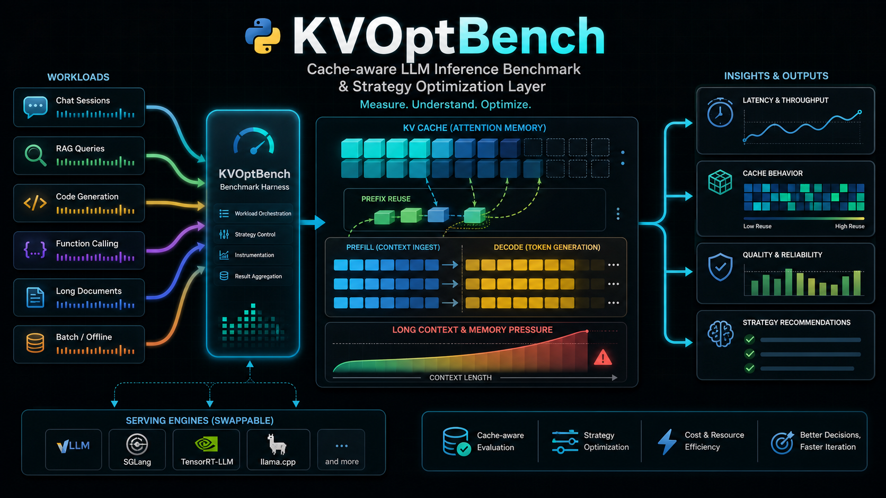

# KVOptBench



KVOptBench is a cache-aware LLM inference benchmark and strategy advisor.

It does not replace serving engines such as vLLM, SGLang, LMCache, Mooncake, or
llm-d. KVOptBench sits above those systems, sends controlled workloads to an
OpenAI-compatible endpoint, records request-level metrics, and turns comparison
results into practical strategy recommendations.

Use it to answer questions such as:

- When does prefix or radix caching actually reduce TTFT?
- How expensive is a cache miss?
- Is a workload prefill-bound, decode-bound, or mixed?
- Does long context create memory pressure or quality risk?
- Does KV quantization improve capacity without hurting quality?
- Does KV offload help or move the bottleneck to host memory and transfer?
- Does speculative decoding help decode-heavy work?
- Is prefill/decode disaggregation worth testing for mixed traffic?

## What KVOptBench Does

- Generates controlled benchmark workloads.
- Runs against mock, vLLM, SGLang, or generic OpenAI-compatible endpoints.
- Measures TTFT, TPOT, ITL, end-to-end latency, throughput, success rate, and quality fields.
- Preserves unavailable backend metrics as `null` and records them in `missing_metrics`.
- Produces JSONL request results, summary CSVs, comparison CSVs, Markdown reports, and strategy-advisor outputs.

## What KVOptBench Does Not Do

- It does not serve models.
- It does not provision GPUs.
- It does not download frontier model weights in tests.
- It does not manage Kubernetes or production orchestration.
- It does not fabricate engine internals when a backend does not expose them.

Users bring any reachable endpoint: local GPU, RunPod, Lambda Cloud, another cloud GPU provider,
bare metal, or an internal OpenAI-compatible serving stack.

## Status

The project currently includes:

- local mock OpenAI-compatible server
- YAML-driven experiment runner
- streaming and non-streaming timing capture
- workload generators for cache, long-context, decode-heavy, RAG, tool-calling, and agentic patterns
- public dataset adapters for QASPER, Project Gutenberg, LongBench, BEIR SciFact, and BFCL
- vLLM and SGLang command previews
- real endpoint health checks and runner support
- request-level metric provenance and environment snapshots
- deterministic repeated-run scheduling helpers
- repeated-run statistical comparison helpers
- live Prometheus, LMCache, and `nvidia-smi` run-window telemetry capture with offline DCGM/parser support
- vLLM bench import foundations
- cache, prefix-overlap, prefill/decode, long-context, KV quantization, KV offload, speculative decoding, and disaggregation comparisons
- public example bundle and report templates
- evidence-based strategy advisor with confidence rationale and follow-up experiment guidance
- reproducible result-package generation with artifact hashes, samples, metric provenance, and missing-metric notes

Real endpoint result collection is the next major validation step.

Public dataset preparation is documented separately from synthetic workload generation.
For real frontier-model testing, use the dataset guide, adapter contract, and generated
manifests before publishing cache, long-context, RAG, or tool-calling claims.

Benchmark validity and metric provenance are part of the public contract. Before
publishing results, read `guides/benchmark_validity.md` and
`guides/metric_provenance.md`.

## Install

```bash
python -m venv .venv
source .venv/bin/activate
python -m pip install -e ".[dev]"
python -m pytest
```

Install optional dataset download dependencies when using Hugging Face-backed public
datasets:

```bash
python -m pip install -e ".[dev,data]"
```

On Windows PowerShell:

```powershell
python -m venv .venv
.\.venv\Scripts\Activate.ps1
python -m pip install -e ".[dev]"
python -m pytest
```

For public dataset downloads on Windows PowerShell:

```powershell
python -m pip install -e ".[dev,data]"
```

## Local Mock Quickstart

The mock path validates the benchmark harness without a GPU, RunPod, model weights, or external API keys.

Create the golden QASPER-shaped starter pack:

```bash
kvoptbench init --output-dir .kvoptbench-starter
```

Start the mock server:

```bash
python -m kvoptbench.mock_server --port 8000
```

In another terminal, run the preflight checks and complete artifact workflow:

```bash
kvoptbench doctor --config .kvoptbench-starter/configs/golden_qasper_mock.yaml
kvoptbench workflow run \
  --config .kvoptbench-starter/configs/golden_qasper_mock.yaml \
  --output-dir results/golden \
  --package-dir results/packages/golden \
  --run-name golden-qasper-mock
kvoptbench validate-results --input .kvoptbench-starter/results/raw
kvoptbench validate-package --path results/packages/golden
```

The workflow command runs the config, writes request JSONL, summarizes to CSV,
generates a Markdown report, writes strategy-advisor outputs, and builds a
reproducible result package.

You can also run the same steps manually:

```bash
kvoptbench generate-workload --profile shared_prefix --out workloads/generated/shared_prefix_32k.jsonl
kvoptbench run --config examples/example_experiment_config.yaml
kvoptbench summarize --input results/raw --output results/summary.csv
kvoptbench report --input results/summary.csv --output reports/mock_report.md
kvoptbench result-package \
  --summary results/summary.csv \
  --raw-input results/raw \
  --report reports/mock_report.md \
  --config examples/example_experiment_config.yaml \
  --output-dir results/packages/mock_smoke
```

Generated workloads, raw results, summaries, reports, and result packages are ignored by git by default.

## Artifact Contracts

KVOptBench commits JSON Schema snapshots for request results, telemetry summaries,
strategy-advisor output, dataset manifests, and result-package manifests under
`schemas/v1`. Use these commands when preparing results for review or publication:

```bash
kvoptbench schema export --output-dir schemas/v1 --check
kvoptbench validate-results --input results/raw
kvoptbench validate-package --path results/packages/golden
```

## Bring Your Own Endpoint

KVOptBench expects a running OpenAI-compatible HTTP endpoint. The endpoint can be local or remote.

Example configs:

| Environment | Config |
|---|---|
| local vLLM | `examples/vllm_openai_compatible_config.yaml` |
| local SGLang | `examples/sglang_openai_compatible_config.yaml` |
| RunPod vLLM | `examples/runpod_vllm_openai_compatible_config.yaml` |
| RunPod SGLang | `examples/runpod_sglang_openai_compatible_config.yaml` |
| Lambda Cloud vLLM | `examples/lambda_cloud_vllm_openai_compatible_config.yaml` |
| generic OpenAI-compatible endpoint | `examples/generic_openai_compatible_config.yaml` |

Edit the config fields that match your server:

- `provider`
- `engine`
- `endpoint_type`
- `base_url`
- `model_id`
- `api_key_env`, only when authentication is required
- `workload_file`
- `output_file`
- `capture_reasoning_content`, optional and disabled by default
- `telemetry`, optional and disabled by default

Then run:

```bash
kvoptbench validate-config --config examples/vllm_openai_compatible_config.yaml
kvoptbench endpoint-check --config examples/vllm_openai_compatible_config.yaml
kvoptbench run --config examples/vllm_openai_compatible_config.yaml
kvoptbench summarize --input results/raw --output results/summary.csv
kvoptbench report --input results/summary.csv --output reports/real_endpoint_report.md
kvoptbench result-package \
  --summary results/summary.csv \
  --raw-input results/raw \
  --report reports/real_endpoint_report.md \
  --config examples/vllm_openai_compatible_config.yaml \
  --output-dir results/packages/real_endpoint_smoke
```

### Live Telemetry

Set `telemetry.enabled: true` when the backend exposes useful runtime metrics.
KVOptBench writes run-level telemetry artifacts separately from request rows:

```text
results/telemetry/<run_id>/telemetry_snapshots.jsonl
results/telemetry/<run_id>/telemetry_summary.json
```

Supported telemetry sources:

- Prometheus-compatible endpoints, such as vLLM `/metrics`.
- live `nvidia-smi` GPU memory sampling.
- LMCache Prometheus metrics or structured JSON/JSONL exports.

Request JSONL rows keep lightweight references to these artifacts and copy
available run-level fields such as `gpu_memory_peak_gb` and cache hit rate into
the normal metric/provenance flow. Unavailable telemetry remains null and is
listed in `missing_metrics`.

### Reasoning and Tool-Calling Models

KVOptBench is compatible with OpenAI-compatible reasoning and tool-calling responses.
Visible answer text, reasoning telemetry, and structured tool calls are recorded as
separate channels in the JSONL results.

- `output_tokens` measures visible answer text only.
- `provider_completion_tokens` preserves the endpoint-reported completion token count when available.
- `reasoning_content_present`, `reasoning_tokens`, `first_reasoning_token_ms`, and
  `visible_answer_missing` make reasoning-only outputs explicit.
- Full `reasoning_content` is not stored unless `capture_reasoning_content: true` is set.
- Tool-call workloads can pass OpenAI-compatible `tools` and `tool_choice` through workload metadata.
  KVOptBench validates tool name and arguments; it does not execute external tools.

### Quality Evaluators

KVOptBench records task quality fields next to latency and cache metrics. Current
local evaluators include:

- `qasper_answer` and `longbench_answer` for exact/contains/token-F1 answer scoring.
- `rag_source_match` for answer plus expected source/document ID coverage.
- `bfcl_tool_call` for function name, argument JSON, and required argument fields.
- `json_validity` and `json_schema` for structured output checks.
- `needle`, `exact_match`, and `contains_expected` for deterministic known-answer tasks.
- `llm_judge_placeholder`, which remains local-only and does not call an external judge.

## Strategy Experiments

The CLI can generate config plans and comparison CSVs for common inference-strategy tests:

- `cache-plan`, `cache-run`, `cache-compare`
- `prefix-sweep-compare`
- `prefill-decode-plan`, `prefill-decode-run`, `prefill-decode-compare`
- `long-context-plan`, `long-context-run`, `long-context-compare`
- `kv-quant-plan`, `kv-quant-run`, `kv-quant-compare`
- `kv-offload-plan`, `kv-offload-run`, `kv-offload-compare`
- `spec-decoding-plan`, `spec-decoding-run`, `spec-decoding-compare`
- `disagg-plan`, `disagg-run`, `disagg-compare`
- `strategy-recommend`
- `result-package`

Command previews document how a compatible server may be started. They do not launch servers:

```bash
kvoptbench engine-command --engine vllm --strategy cache_on --model-id your/model
kvoptbench engine-command --engine sglang --strategy cache_off --model-id your/model
```

For official real endpoint results, record the exact backend command, engine version, model revision,
GPU type, workload hash, config hash, and `missing_metrics`.

Official results should also document metric provenance, randomized condition order,
repeated trials, confidence intervals when available, and whether every recommendation is
official or exploratory.

The reusable Python helpers for these foundations are available in:

- `kvoptbench.runner.schedule` for deterministic repeated-run schedules.
- `kvoptbench.analysis.statistics` for repeated-trial aggregation and percent-delta comparisons.
- `kvoptbench.telemetry.runtime` for before/during/after run telemetry collection.
- `kvoptbench.telemetry.prometheus`, `kvoptbench.telemetry.nvidia_smi`, and
  `kvoptbench.telemetry.lmcache` for telemetry normalization.
- `kvoptbench.importers.vllm_bench` for importing vLLM bench artifacts into KVOptBench-like rows.

## Real/Public Dataset Packs

Synthetic generators are useful for smoke tests, but credible public results should use
documented public datasets with manifests and workload hashes.

Start here:

- `guides/datasets.md`: recommended public datasets and what each validates
- `guides/dataset_adapter_contract.md`: implemented adapter CLI, JSONL schema, and manifest contract
- `guides/frontier_dataset_pack.md`: first self-hosted frontier testing pack

The recommended first public run uses QASPER shared-prefix and random-prefix controls at
8K and 32K against one self-hosted vLLM or SGLang endpoint. Project Gutenberg, LongBench,
BEIR SciFact, and BFCL are available when you want to expand into long-context pressure,
RAG, and tool-calling experiments.

Prepare a QASPER workload from an existing local source file:

```bash
kvoptbench dataset prepare \
  --source qasper \
  --mode shared_prefix \
  --split validation \
  --source-path tests/fixtures/datasets/qasper_tiny.json \
  --target-input-tokens 8192 \
  --target-output-tokens 256 \
  --out workloads/generated/qasper_shared_prefix_8k.jsonl \
  --manifest workloads/generated/qasper_shared_prefix_8k_manifest.json
```

Allow the adapter to download and cache public source data explicitly:

```bash
kvoptbench dataset prepare \
  --source qasper \
  --mode shared_prefix \
  --download \
  --cache-dir data/raw \
  --split validation \
  --max-items 100 \
  --target-input-tokens 32768 \
  --target-output-tokens 256 \
  --out workloads/generated/qasper_shared_prefix_32k.jsonl \
  --manifest workloads/generated/qasper_shared_prefix_32k_manifest.json
```

Other implemented dataset adapters use the same command shape:

```bash
kvoptbench dataset prepare --source gutenberg --mode needle --download --book-ids 1342,84,2701 --context-buckets 8192,32768 --out workloads/generated/gutenberg_needle.jsonl --manifest workloads/generated/gutenberg_needle_manifest.json
kvoptbench dataset prepare --source longbench --mode long_context_qa --download --subset qasper,multifieldqa_en --max-items 100 --out workloads/generated/longbench_core.jsonl --manifest workloads/generated/longbench_core_manifest.json
kvoptbench dataset prepare --source beir_scifact --mode rag --download --max-items 100 --out workloads/generated/beir_scifact_rag.jsonl --manifest workloads/generated/beir_scifact_rag_manifest.json
kvoptbench dataset prepare --source bfcl --mode tool_calling --download --subset BFCL_v3_simple --max-items 100 --out workloads/generated/bfcl_tool_calling.jsonl --manifest workloads/generated/bfcl_tool_calling_manifest.json
```

Generated workloads and cached raw datasets stay out of git by default. Commit adapter
code, tiny fixtures, manifests for examples when appropriate, and result templates, not
large raw downloads.

## Public Example Bundle

`examples/public_release/` contains deterministic fixture CSVs, a mock report, and strategy-advisor
outputs. These examples prove the reporting pipeline works. They are not real vLLM, SGLang, LMCache,
Mooncake, or llm-d performance claims.

Regenerate the advisor and combined report with:

```bash
kvoptbench strategy-recommend \
  --summary examples/public_release/summary.csv \
  --cache-input examples/public_release/cache_summary.csv \
  --prefix-sweep-input examples/public_release/prefix_sweep.csv \
  --prefill-decode-input examples/public_release/prefill_decode.csv \
  --long-context-input examples/public_release/long_context.csv \
  --kv-quant-input examples/public_release/kv_quantization.csv \
  --kv-offload-input examples/public_release/kv_offload.csv \
  --spec-decoding-input examples/public_release/speculative_decoding.csv \
  --disagg-input examples/public_release/disaggregation.csv \
  --json-output reports/outputs/strategy_advisor.json \
  --markdown-output reports/outputs/strategy_advisor.md

kvoptbench report \
  --input examples/public_release/summary.csv \
  --cache-input examples/public_release/cache_summary.csv \
  --prefix-sweep-input examples/public_release/prefix_sweep.csv \
  --prefill-decode-input examples/public_release/prefill_decode.csv \
  --long-context-input examples/public_release/long_context.csv \
  --kv-quant-input examples/public_release/kv_quantization.csv \
  --kv-offload-input examples/public_release/kv_offload.csv \
  --spec-decoding-input examples/public_release/speculative_decoding.csv \
  --disagg-input examples/public_release/disaggregation.csv \
  --strategy-input reports/outputs/strategy_advisor.json \
  --output reports/outputs/mock_benchmark_report.md

kvoptbench result-package \
  --summary examples/public_release/summary.csv \
  --report reports/outputs/mock_benchmark_report.md \
  --artifact examples/public_release/cache_summary.csv \
  --artifact examples/public_release/prefix_sweep.csv \
  --artifact examples/public_release/prefill_decode.csv \
  --artifact examples/public_release/long_context.csv \
  --artifact examples/public_release/kv_quantization.csv \
  --artifact examples/public_release/kv_offload.csv \
  --artifact examples/public_release/speculative_decoding.csv \
  --artifact examples/public_release/disaggregation.csv \
  --artifact reports/outputs/strategy_advisor.json \
  --output-dir results/packages/mock_public_example
```

`result-package` writes `run_manifest.json`, `missing_metrics.json`, `metric_provenance.json`,
`README_result.md`, artifact hashes, JSONL samples when raw/workload files are provided,
copied telemetry artifacts referenced by raw rows, copied dataset manifests, and redacted
config snapshots. Treat the generated bundle as local output until you have checked dataset
rights, private prompt exposure, and endpoint metadata.

## Guides

- `guides/benchmark_validity.md`
- `guides/metric_provenance.md`
- `guides/reproducibility.md`
- `guides/real_endpoint_vllm_sglang.md`
- `guides/runpod.md`
- `guides/first_real_benchmark.md`
- `guides/datasets.md`
- `guides/dataset_adapter_contract.md`
- `guides/frontier_dataset_pack.md`
- `examples/public_release/result_template.md`
- `examples/public_release/blog_report_template.md`

## Contributing

Good contributions improve reproducibility, workload coverage, engine support, metric parsing,
quality evaluation, reporting, or safe public examples. See `CONTRIBUTING.md` and `SECURITY.md`.

## License

MIT License.
