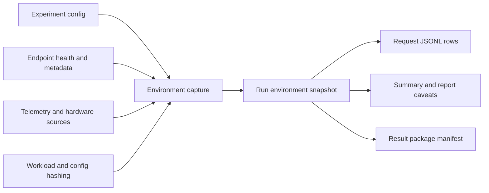

# Environment Capture Architecture

Status: Draft
Date: 2026-07-01
Owner: KVOptBench maintainers

## 1. Problem Statement and Goals

KVOptBench result rows and packages need enough environment metadata to reproduce
and audit a benchmark without exposing secrets, private endpoint details, private
workload data, or local machine paths. The capture design must support local GPU
runs, RunPod-hosted endpoints, Lambda Cloud endpoints, and generic
OpenAI-compatible endpoints with the same public-safe contract.

Goals:

- Capture benchmark-side runtime metadata such as Python version, platform,
  KVOptBench version, git commit, git branch, dirty state, and selected package
  versions.
- Capture backend metadata needed for reproducibility: engine version, model
  revision, CUDA version, GPU type and count, backend launch command, config hash,
  and workload hash when available.
- Distinguish run-level environment metadata from request-level metadata.
- Preserve unavailable environment fields as null or missing rather than guessing.
- Package environment metadata with hashes and redaction rules suitable for public
  publishing.
- Keep tests local and deterministic, with no GPU, provider account, external API, or
  model download requirement.

Non-goals:

- KVOptBench does not provision infrastructure or manage endpoint lifecycle.
- KVOptBench does not require RunPod, Lambda Cloud, or any provider for local tests.
- KVOptBench does not store credential values, private endpoint URLs, private prompts,
  or private model outputs in publishable metadata.
- KVOptBench does not infer engine versions, model revisions, GPU details, or CUDA
  details when the backend or user-provided metadata does not expose them.

## 2. Inputs and References

This design aligns with:

- `AGENTS.md`
- `README.md`
- `SECURITY.md`
- `guides/benchmark_validity.md`
- `guides/metric_provenance.md`
- `guides/reproducibility.md`
- `guides/real_endpoint_vllm_sglang.md`
- `examples/vllm_openai_compatible_config.yaml`
- `examples/runpod_vllm_openai_compatible_config.yaml`
- `examples/lambda_cloud_vllm_openai_compatible_config.yaml`
- `examples/generic_openai_compatible_config.yaml`
- `kvoptbench/schemas.py`
- `kvoptbench/runner/environment.py`
- `kvoptbench/runner/experiment.py`
- `kvoptbench/packaging/result_package.py`
- `tests/test_runner_schema.py`
- `tests/test_result_package.py`

Current foundation:

- `RunEnvironmentSnapshot` captures benchmark-side Python version, platform,
  KVOptBench version, git commit, git branch, dirty state, selected package versions,
  and open metadata.
- The runner captures an environment snapshot once per experiment run and currently
  attaches it to each request result row.
- Request rows already include backend-related fields such as `provider`, `engine`,
  `engine_version`, `model_id`, `gpu_type`, and `gpu_count`, with unavailable values
  preserved as missing metrics where appropriate.
- Result packages already redact config snapshots, omit absolute local paths from
  package contracts, hash artifacts, and list unavailable metrics.

This document defines the target environment capture contract. It does not claim that
all target fields are already captured automatically.

## 3. Requirements and Constraints

Functional requirements:

- Environment capture is run-scoped by default.
- Request rows can reference or embed the run environment snapshot, but request-level
  metadata should only contain values that can vary per request.
- Backend metadata can come from endpoint health checks, config metadata, user-supplied
  public fields, telemetry artifacts, or imported benchmark artifacts.
- Missing backend metadata remains explicit and should affect publishability or
  confidence when the missing field is needed for the claim.
- Result packages include redacted environment snapshots and artifact hashes needed to
  reproduce the run.

Constraints:

- Public package metadata must not include credential values, private endpoint URLs,
  private workload data, private prompt text beyond approved samples, or absolute
  local paths.
- Config-driven capture should support local, remote, and generic endpoints without
  requiring provider-specific code in the generic runner.
- Unit tests must mock git, package metadata, endpoint metadata, and hardware
  discovery where needed.
- Environment fields should be stable and schema-versioned so old result packages
  remain readable.

## 4. Recommended Architecture

Environment capture should produce one run-level snapshot before benchmark requests
are sent, then write request rows that either embed the snapshot or point to a
package-level environment artifact.



Recommended implementation stages:

1. Continue capturing current benchmark-side runtime metadata.
2. Add hash capture for config and workload files.
3. Add public backend metadata fields through config `metadata` or
   `endpoint_metadata`, not through hardcoded provider assumptions.
4. Add optional telemetry-derived hardware fields when telemetry is supplied.
5. Add package-level environment artifacts and keep request rows backward compatible.

## 5. Run-Level Environment Contract

Run-level metadata describes the benchmark process, configured endpoint, workload, and
backend environment for the whole run.

Target contract:

```json
{
  "schema_version": "1",
  "environment_id": "env-1730000000-cache-smoke",
  "captured_at": "2026-07-01T12:00:00Z",
  "run_id": "1730000000-cache-smoke",
  "experiment_id": "cache-smoke",
  "official_run": false,
  "provider": "local",
  "endpoint_type": "vllm",
  "engine": "vllm",
  "engine_version": "0.6.x",
  "model_id": "example/model",
  "model_revision": "public-revision-or-null",
  "benchmark_runtime": {
    "python_version": "3.11.x",
    "platform": "Linux",
    "platform_release": "kernel-or-os-release",
    "platform_machine": "x86_64",
    "kvoptbench_version": "0.1.0",
    "git_commit": "commit-sha",
    "git_branch": "branch-name",
    "git_dirty": false,
    "package_versions": {
      "pydantic": "version",
      "pandas": "version"
    }
  },
  "backend_runtime": {
    "backend_launch_command": "vllm serve example/model --enable-prefix-caching",
    "runtime_image": "public-image-or-null",
    "cuda_version": "12.x",
    "driver_version": "550.x",
    "gpu_type": "NVIDIA A100",
    "gpu_count": 1
  },
  "artifacts": {
    "config_sha256": "sha256",
    "workload_sha256": "sha256",
    "dataset_manifest_sha256": "sha256-or-null"
  },
  "redactions": [
    "base_url",
    "api_key_env value",
    "secret-bearing launch flags"
  ],
  "missing_environment_fields": [
    {
      "field": "model_revision",
      "reason": "The configured endpoint did not expose a model revision."
    }
  ]
}
```

Required run-level fields:

- `schema_version`
- `captured_at`
- `run_id`, once created by the runner
- `experiment_id`
- `provider`
- `endpoint_type`
- `engine`
- `model_id`
- benchmark runtime block
- config and workload hashes when the files are available
- redaction list when any fields are redacted

Expected but nullable fields:

- `engine_version`
- `model_revision`
- `backend_launch_command`
- `runtime_image`
- `cuda_version`
- `driver_version`
- `gpu_type`
- `gpu_count`
- `dataset_manifest_sha256`

## 6. Request-Level Environment Metadata

Most environment fields are run-level and should not be repeated as if they vary per
request. Request rows should keep the fields needed for grouping and backward
compatibility:

- `run_id`
- `experiment_id`
- `provider`
- `engine`
- `engine_version`, nullable
- `model_id`
- `gpu_type`, nullable
- `gpu_count`, nullable
- `task_id`
- `metadata.endpoint_health`, when captured safely
- `environment`, for backward-compatible embedded snapshots

Target request-level extension:

```json
{
  "run_id": "1730000000-cache-smoke",
  "experiment_id": "cache-smoke",
  "task_id": "qasper_shared_001",
  "environment_id": "env-1730000000-cache-smoke",
  "request_environment": {
    "endpoint_model_id": "example/model",
    "response_system_fingerprint": null,
    "response_headers_captured": true
  }
}
```

Request-level rules:

- Use `environment_id` to link to the run-level snapshot when package size or repeated
  row duplication becomes a problem.
- Keep the existing embedded `environment` field readable for backward compatibility.
- Store per-request response metadata only when it is public-safe and explicitly
  enabled.
- Do not store full response headers by default. Header capture should remain
  configurable because headers can contain deployment details.

## 7. Safe Storage and Redaction Rules

| Data | Store in raw results | Store in public package | Rule |
|---|---:|---:|---|
| `engine`, `endpoint_type`, `provider` | Yes | Yes | Public-safe grouping fields. |
| Engine version | Yes | Yes | Store when reported or user-provided. |
| Model id | Yes | Yes, if publishable | Use the served model id needed for reproduction. |
| Model revision | Yes | Yes, if public | Store public revision, commit, or image digest when available. |
| GPU type and count | Yes | Yes | Required for credible hardware comparison. |
| CUDA and driver versions | Yes | Yes | Store when available; otherwise mark missing. |
| Config hash and workload hash | Yes | Yes | Hashes are required for reproducibility. |
| Backend launch command | Yes, redacted | Yes, redacted | Remove tokens, private paths, and private host details. |
| Runtime image | Yes, if public-safe | Yes, if public-safe | Redact private registry host or digest if required. |
| Endpoint URL | Local only if needed | No | Redact as `<redacted_url>` in package configs. |
| API key environment variable name | Yes | Usually yes | Store the variable name only, never the value. |
| API key, token, password, bearer value | No | No | Never store credential values. |
| Private prompts and private outputs | No by default | No by default | Publish only reviewed samples or public dataset artifacts. |
| Absolute local paths | No | No | Store package-relative paths. |

Redaction should run before packaging and should also apply to user-provided metadata.
If a launch command contains secret-bearing flags or private paths, replace only the
sensitive value and preserve the public flags needed to understand the run.

## 8. Provider Examples

The same environment contract should work across supported endpoint shapes.

### Local GPU Endpoint

Example:

- `provider: local`
- `endpoint_type: vllm` or `sglang`
- User starts the backend separately.
- KVOptBench records the public backend command, engine version, model id, optional
  model revision, GPU type/count, CUDA/driver versions, config hash, and workload hash.
- Endpoint URL is useful locally but is redacted in packages.
- GPU telemetry can come from `nvidia-smi`, DCGM, or a Prometheus exporter when
  configured.

### RunPod Endpoint

Example:

- `provider: runpod`
- `endpoint_type: vllm` or `sglang`
- User supplies a reachable OpenAI-compatible endpoint.
- KVOptBench records provider name, engine, model id, public runtime image when
  provided, GPU type/count when provided or captured, launch command when provided,
  config hash, and workload hash.
- Pod identifiers, private proxy hosts, and token values are redacted from public
  packages.
- If the provider does not expose GPU or engine metadata, fields remain null and
  missing reasons are recorded.

### Lambda Cloud Endpoint

Example:

- `provider: lambda_cloud`
- `endpoint_type: vllm`, `sglang`, or `openai_compatible`
- User supplies a reachable endpoint and backend metadata when available.
- KVOptBench records the same reproducibility fields as local and RunPod runs.
- Instance hostnames and credentials are redacted from package metadata.
- GPU type/count and CUDA/driver versions should be captured from telemetry or
  user-provided public metadata when available.

### Generic OpenAI-Compatible Endpoint

Example:

- `provider: other`
- `endpoint_type: openai_compatible`
- Engine internals may be unavailable.
- KVOptBench records model id, endpoint type, benchmark runtime, config hash, workload
  hash, and response-level provider metadata when safe.
- Engine version, model revision, CUDA version, GPU type/count, and launch command may
  be null with explicit missing reasons.
- Strategy recommendations should avoid backend-internal claims when the generic
  endpoint exposes only client-observed latency and provider response fields.

## 9. Relationship to Result Packages

Result packages are the review and publishing unit for completed benchmark evidence.
Environment capture should integrate with package generation as follows:

- Add a package artifact such as `environment/run_environment.json` when supplied.
- Include the environment artifact in `run_manifest.json` with a package-relative path,
  role, size, and hash.
- Include config and workload hashes in both the environment artifact and package
  manifest so reviewers can cross-check inputs.
- Keep redacted config snapshots as the public representation of config values.
- List unavailable environment fields either in an environment-specific missing list or
  in `missing_metrics.json` when the field corresponds to a metric used by reports.
- Reports and result templates should state whether environment capture is complete
  enough for official publication.

Public publishing guidance:

- A package can be useful when environment metadata is incomplete, but it should be
  labeled exploratory when required reproducibility fields are missing.
- Official comparisons should include engine version, model revision or public model
  identifier, backend launch command, GPU type/count, CUDA or driver details when
  applicable, config hash, workload hash, run order, repetitions, and missing telemetry
  notes.
- Do not publish private endpoint URLs, credentials, private workload data, or raw
  private prompts as part of environment capture.

## 10. Reliability and Failure Handling

Environment capture should be best-effort but explicit:

- If git metadata is unavailable, set git fields to null and continue.
- If package versions cannot be resolved, omit only the unresolved package version.
- If endpoint metadata is unavailable, record a missing environment field rather than
  failing the benchmark.
- If config or workload hashing fails for a required file, fail before packaging
  because reproducibility would be incomplete.
- If redaction detects a secret-bearing field that cannot be safely transformed, fail
  package creation with a clear error.

Capture should not block request execution for slow optional metadata sources. Expensive
metadata discovery should run with bounded timeouts or be supplied explicitly in config.

## 11. Testing and Validation Plan

Unit tests:

- Validate `RunEnvironmentSnapshot` serialization remains backward compatible.
- Mock git commands to cover clean repo, dirty repo, missing git, and timeout cases.
- Verify package-version capture tolerates missing packages.
- Verify config and workload hash capture is deterministic.
- Verify missing engine version, model revision, CUDA version, GPU type, and GPU count
  are represented as explicit missing environment fields.
- Verify redaction removes endpoint URLs, credential values, private path-like values,
  and secret-bearing launch flags.

Integration tests:

- Run the mock endpoint and confirm current environment capture still appears in
  request rows.
- Build a result package with a supplied environment artifact and confirm manifest
  paths, hashes, and redacted config snapshots.
- Build local fixture examples for local GPU, RunPod, Lambda Cloud, and generic
  endpoint metadata without contacting providers.
- Confirm reports can summarize missing environment fields without converting them to
  zeros or empty strings that look available.

Regression checks:

- No tests require a GPU, live provider endpoint, external API, or model download.
- Generated packages do not include credential values, private endpoint URLs, or
  absolute local paths.
- Existing result-package and schema tests continue to pass.

Recommended command set after implementation:

```bash
pytest tests/test_runner_schema.py tests/test_result_package.py -q
pytest -q
```

## 12. Acceptance Criteria

- Run-level environment capture includes current benchmark runtime fields and target
  backend reproducibility fields when available.
- Engine version, model revision, CUDA version, GPU type/count, backend launch command,
  config hash, and workload hash are either captured or explicitly marked missing.
- Request rows keep backward-compatible environment data while supporting a future
  `environment_id` link to a run-level artifact.
- Local GPU, RunPod, Lambda Cloud, and generic OpenAI-compatible endpoints use the
  same schema and redaction policy.
- Result packages include redacted environment artifacts with package-relative paths
  and hashes.
- Public publishing guidance distinguishes complete official evidence from
  exploratory packages with missing environment fields.
- Tests validate capture, redaction, missing-field behavior, and packaging without
  external services.

## 13. Risks and Open Questions

Risks:

- Users may provide launch commands that contain secrets or private paths. Redaction
  tests must cover common command-line patterns.
- Generic endpoints may expose little backend metadata. Reports must avoid claims that
  require unavailable internals.
- Repeating the full environment snapshot on every request row can increase JSONL size.
  A future `environment_id` artifact can reduce duplication while preserving backward
  compatibility.

Open questions:

- Should package generation require a complete environment artifact for official runs,
  or should it emit warnings and let the report label the run exploratory?
- Should model revision be captured from backend metadata, user config, dataset
  manifest metadata, or all available sources with precedence rules?
- Should response headers be stored as request-level metadata only through an allowlist?

## 14. Next Actions

1. Extend the environment schema with optional backend and artifact hash fields.
2. Add deterministic config and workload hash capture to the runner.
3. Add redaction helpers for backend launch commands and user-provided environment
   metadata.
4. Add package support for `environment/run_environment.json`.
5. Add report caveats for missing environment fields that affect publishability.
6. Add fixture-based tests for local, RunPod, Lambda Cloud, and generic endpoint
   environment examples.
