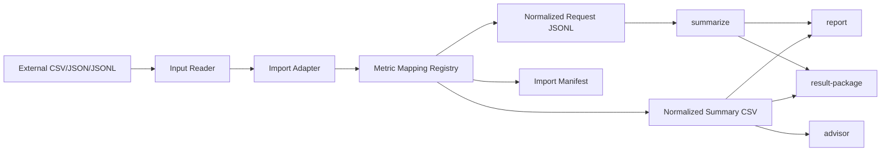

# Import Adapters and Metric Mapping Architecture

Status: Proposed
Date: 2026-07-01
Owner: KVOptBench maintainers

## 1. Problem Statement and Goals

KVOptBench is the evidence and decision layer above serving systems such as
vLLM, SGLang, LMCache, Mooncake, llm-d, and generic OpenAI-compatible
endpoints. It should be able to ingest benchmark artifacts produced outside
KVOptBench without claiming that KVOptBench ran those experiments itself.

The import architecture has four goals:

- Normalize external benchmark outputs into KVOptBench-compatible evidence.
- Preserve metric provenance, source format, units, and caveats for every
  imported metric.
- Keep unavailable metrics explicit through `missing_metrics` and provenance
  records instead of converting them to zero or omitting them silently.
- Allow imported evidence to flow into summary, report, result-package, and
  advisor workflows with clear confidence boundaries.

Non-goals:

- Do not run or manage vLLM, SGLang, LMCache, Mooncake, llm-d, Triton, NIM, or
  other serving processes.
- Do not become a replacement for vLLM bench, GenAI-Perf, AIPerf, or other load
  generators.
- Do not fabricate request-level rows from aggregate-only source artifacts.
- Do not infer GPU, cache, or quality metrics that the source artifact did not
  provide.
- Do not persist private endpoint URLs, credentials, prompts, responses, or
  absolute source paths in public artifacts.

## 2. Inputs and References

Local source references used for this design:

- `docs/architecture/README.md`
- `kvoptbench/importers/vllm_bench.py`
- `tests/test_vllm_bench_import.py`
- `kvoptbench/schemas.py`
- `kvoptbench/analysis/summarize.py`
- `kvoptbench/reports/generate.py`
- `kvoptbench/packaging/result_package.py`
- `kvoptbench/strategy/advisor.py`

Public external references used for compatibility context:

- NVIDIA GenAI-Perf documentation notes that GenAI-Perf is being phased out and
  points new benchmarking work to AIPerf:
  <https://docs.nvidia.com/deeplearning/triton-inference-server/user-guide/docs/perf_analyzer/genai-perf/README.html>
- NVIDIA AIPerf migration documentation describes AIPerf as a migration path for
  currently supported GenAI-Perf features:
  <https://docs.nvidia.com/aiperf/getting-started/migrating-from-gen-ai-perf>
- NVIDIA AIPerf metrics documentation describes exported timing, token,
  throughput, request, and error metrics:
  <https://docs.nvidia.com/aiperf/reference/ai-perf-metrics-reference>

## 3. Current State

KVOptBench currently has a vLLM bench import module:

- `import_vllm_bench(source, experiment_id, workload, ...)` reads one local
  source artifact.
- Supported source formats are `.jsonl`, `.json`, and `.csv`.
- JSONL input is read one non-empty JSON object per line.
- CSV input is read with header-based dictionaries.
- JSON input supports a top-level list, a top-level object with one of
  `requests`, `results`, `rows`, or `samples`, or a single object.
- External field names are normalized by trimming, lowercasing, and replacing
  spaces or dashes with underscores.
- The importer maps aliases for token counts, TTFT, TPOT, end-to-end latency,
  GPU memory used, and GPU memory peak.
- Each imported row receives KVOptBench-like fields such as `run_id`,
  `experiment_id`, `provider`, `engine`, `model_id`, `strategy`, `workload`,
  `task_id`, `concurrency`, token counts, latency metrics, throughput metrics,
  memory metrics, success state, errors, `missing_metrics`, and `metadata`.
- Missing vLLM bench metrics are preserved as names in `missing_metrics` and as
  human-readable reasons in `metadata.missing_metric_reasons`.
- The source path recorded in metadata is currently the source file name, not an
  absolute path.

Current hardening gaps:

- The importer does not yet emit `metric_provenance` entries for imported
  fields.
- Alias mappings are implemented in Python lists rather than a shared metric
  mapping registry.
- Import granularity is not explicit. A source row could represent a request,
  run summary, or aggregate depending on the source tool and export mode.
- There is no public CLI contract for invoking imports and writing normalized
  artifacts.
- There is no shared source manifest for input hashes, sanitized source labels,
  adapter versions, and mapping registry versions.

## 4. Requirements and Constraints

Functional requirements:

- Support adapter-specific parsing for vLLM bench, GenAI-Perf compatibility
  artifacts, and AIPerf artifacts.
- Normalize `.csv`, `.json`, and `.jsonl` files through one input reader layer
  shared by adapters.
- Emit imported metrics with `source_type=imported`.
- Preserve raw source field names used for mapping without persisting raw
  request or response bodies by default.
- Record every required normalized metric as available or missing.
- Preserve optional metrics when present and explain their absence when they
  affect downstream confidence.
- Write output that can be consumed by existing summary, report,
  result-package, and advisor flows.

Non-functional requirements:

- Import must be deterministic for the same source artifact and CLI arguments.
- Import must not require a GPU, model weights, external APIs, or live serving
  endpoints.
- Import must fail loudly on unsupported formats, malformed source files, or
  ambiguous aggregate/request granularity unless the user chooses an explicit
  mode.
- Import artifacts must be public-safe by default.

## 5. Assumptions

- External tools will continue to change field names and export layouts, so
  adapter behavior must be fixture-tested by tool and version rather than
  assumed stable.
- Request-level exports and aggregate exports will both exist. KVOptBench should
  preserve the difference instead of forcing every source into request-level
  JSONL.
- Imported evidence is useful for comparison and advisor workflows, but advisor
  confidence should be lower when required telemetry or request-level support is
  missing.
- Initial implementation can keep the registry as checked-in structured data or
  typed Python data. A separate package or plugin system is unnecessary until
  external mappings need independent release cadence.

## 6. Alternatives Considered

### Generic DataFrame Mapper Only

A generic mapper could let users pass a CSV and a field map. This is flexible,
but it does not capture tool-specific units, aggregate semantics, source
provenance, or caveats well enough for result-package and advisor confidence.

### One Hard-Coded Adapter Per Tool

Each adapter could own all aliases and conversions in code. This matches the
current vLLM bench foundation, but it duplicates provenance rules and makes it
hard to audit whether two adapters map the same concept consistently.

### Recommended: Adapter Pipeline Plus Shared Metric Mapping Registry

Use adapter-specific readers for source layout and a shared metric mapping
registry for normalized field semantics. This keeps source parsing close to the
tool while making units, provenance, required metrics, and caveats auditable.

## 7. Recommended Architecture

The import system should have four layers:

1. Input reader: detects and reads CSV, JSON, and JSONL into records plus source
   metadata.
2. Adapter: selects tool-specific row extraction, version detection, granularity,
   and source metadata.
3. Metric mapping registry: maps external tool fields to normalized KVOptBench
   fields with units, source type, measurement methods, and caveats.
4. Output writer: writes normalized request JSONL, normalized summary CSV, import
   manifest, and optional mapping audit artifacts.



The recommended default is request-level import when the source artifact
contains request-level rows. Aggregate-only source artifacts should produce a
summary-compatible CSV and an import manifest, not fake request rows.

## 8. Component Design and Data Flow

### Input Reader

The reader accepts:

| Format | Behavior | Failure Mode |
|---|---|---|
| CSV | Read headers with `csv.DictReader`; keep values as strings until adapter conversion. | Fail if no header or no data rows. |
| JSONL | Read each non-empty line as one JSON object. | Fail with line number on invalid JSON or non-object rows. |
| JSON | Accept a top-level list, a top-level object, or configured nested list paths. | Fail if no configured row path can be found for the selected adapter. |

All readers return:

```json
{
  "records": [],
  "source_format": "csv|json|jsonl",
  "source_file_name": "artifact.jsonl",
  "source_sha256": "hex",
  "reader_warnings": []
}
```

### Adapter Interface

Each adapter should implement this conceptual contract:

```python
class ImportAdapter:
    tool_name: str
    supported_formats: set[str]

    def detect_version(self, source_metadata, records) -> str | None: ...
    def detect_granularity(self, records) -> str: ...
    def normalize(self, records, context, registry) -> ImportResult: ...
```

`ImportResult` should contain:

```json
{
  "tool": "vllm_bench|genai_perf|aiperf",
  "tool_version": "optional",
  "adapter_version": "1",
  "mapping_registry_version": "1",
  "granularity": "request|run_summary|aggregate",
  "request_rows": [],
  "summary_rows": [],
  "missing_metrics": [],
  "metric_provenance": {},
  "source_manifest": {}
}
```

### vLLM Bench Adapter

Current behavior should remain the compatibility baseline:

- Continue supporting CSV, JSON, and JSONL.
- Continue accepting known aliases for token counts, TTFT, TPOT, latency, and GPU
  memory fields.
- Continue preserving unavailable metrics in `missing_metrics`.
- Continue recording source format, source row index, source file name, missing
  reasons, and raw field names in metadata.

Future hardening:

- Add `metric_provenance` entries for every mapped metric.
- Add `metadata.import_granularity` with one of `request`, `run_summary`, or
  `aggregate`.
- Move aliases into the shared metric mapping registry.
- Add explicit unit conversion for memory and timing fields rather than assuming
  suffix-based units.
- Add adapter fixture tests for representative vLLM bench JSONL, JSON, and CSV
  exports.
- Fail or warn when a source field looks aggregate-only but is being written to
  request-level JSONL.

### GenAI-Perf and AIPerf Adapter

GenAI-Perf should be treated as a compatibility adapter for existing artifacts.
AIPerf should be the preferred future path for new NVIDIA benchmarking imports
because public NVIDIA documentation describes GenAI-Perf as being phased out and
points new benchmarking work to AIPerf.

The adapter family should support:

- GenAI-Perf CSV and JSON exports for historical runs.
- AIPerf CSV, JSON, JSONL, and aggregate exports where available.
- AIPerf timing, token, throughput, request count, error, usage, goodput, and
  optional GPU telemetry metrics when present.
- AIPerf/GenAI-Perf migration caveats for metrics that are not equivalent across
  both tools.

Important compatibility caveats:

- GenAI-Perf TTFT and AIPerf TTFT can differ for reasoning-capable models. AIPerf
  documents TTFO as the comparable path for some GenAI-Perf TTFT comparisons.
- AIPerf can emit richer usage, reasoning, goodput, and HTTP timing metrics than
  the initial KVOptBench normalized schema needs. Preserve these as optional
  metadata or future normalized fields rather than discarding them silently.
- AIPerf is client-side and does not emit server-side `gen_ai.server.*` metrics.
  Server-side metrics must remain missing unless a separate telemetry source
  provides them.

## 9. Metric Mapping Registry Contract

The registry is the auditable source of truth for how imported tool fields map
to normalized KVOptBench fields.

Required mapping fields:

| Field | Meaning |
|---|---|
| `external_tool` | Source tool, for example `vllm_bench`, `genai_perf`, or `aiperf`. |
| `external_field` | Source field, source table label, JSON path, or alias group. |
| `normalized_field` | KVOptBench field such as `ttft_ms`, `tpot_ms`, or `output_tokens_per_second`. |
| `unit` | Normalized unit, for example `ms`, `tokens`, `requests/s`, `tokens/s`, `GB`, or `ratio`. |
| `source_type` | Must be `imported` for imported metrics. |
| `measurement_method` | Human-readable method, for example `tool-reported request timing`. |
| `loss_or_caveat` | Any conversion loss, aggregate caveat, semantic mismatch, or version caveat. |
| `required` | Whether this field is required for the adapter mode. |

Recommended additional fields:

| Field | Meaning |
|---|---|
| `adapter_version` | Mapping version used by the adapter. |
| `tool_version_range` | Tool versions or export schemas covered by the mapping. |
| `granularity` | `request`, `run_summary`, `aggregate`, or `any`. |
| `statistic` | `value`, `mean`, `p50`, `p95`, `count`, or another explicit statistic. |
| `converter` | Named conversion such as `seconds_to_ms`, `ns_to_ms`, or `identity`. |
| `required_for` | Downstream feature requiring the metric, such as `latency_report` or `kv_offload_advisor`. |

Example registry rows:

| external_tool | external_field | normalized_field | unit | source_type | measurement_method | loss_or_caveat | required |
|---|---|---|---|---|---|---|---|
| `vllm_bench` | `num_input_tokens`, `prompt_tokens`, `input_len` | `input_tokens` | `tokens` | `imported` | tool-reported token count | alias source differs by export | true |
| `vllm_bench` | `num_output_tokens`, `completion_tokens`, `output_len` | `output_tokens` | `tokens` | `imported` | tool-reported token count | alias source differs by export | true |
| `vllm_bench` | `ttft_ms`, `time_to_first_token_ms`, `mean_ttft_ms` | `ttft_ms` | `ms` | `imported` | tool-reported TTFT | aggregate aliases must not be treated as request samples | false |
| `vllm_bench` | `tpot_ms`, `time_per_output_token_ms`, `mean_tpot_ms` | `tpot_ms` | `ms` | `imported` | tool-reported TPOT | aggregate aliases must carry statistic metadata | false |
| `vllm_bench` | `latency_ms`, `request_latency_ms`, `mean_latency_ms` | `e2e_latency_ms` | `ms` | `imported` | tool-reported request latency | end-to-end definition varies by source exporter | false |
| `vllm_bench` | `gpu_memory_used_gb`, `memory_used_gb` | `gpu_memory_used_gb` | `GB` | `imported` | tool-reported memory snapshot | may be absent on client-only exports | false |
| `vllm_bench` | `gpu_memory_peak_gb`, `peak_gpu_memory_gb` | `gpu_memory_peak_gb` | `GB` | `imported` | tool-reported peak memory | may be absent on client-only exports | false |
| `genai_perf` | TTFT export field or table label | `ttft_ms` | `ms` | `imported` | GenAI-Perf reported TTFT | compatibility path only; reasoning-token semantics may differ from AIPerf | false |
| `genai_perf` | inter-token latency export field or table label | `itl_ms` | `ms` | `imported` | GenAI-Perf reported inter-token latency | exact statistic depends on export row | false |
| `genai_perf` | output token throughput export field or table label | `output_tokens_per_second` | `tokens/s` | `imported` | GenAI-Perf reported throughput | aggregate metric, not request-level | false |
| `aiperf` | `time_to_first_token` | `ttft_ms` | `ms` | `imported` | AIPerf reported TTFT | compare to GenAI-Perf carefully for reasoning-capable models | false |
| `aiperf` | `time_to_first_output_token` | `ttft_ms` | `ms` | `imported` | AIPerf reported first output token timing | preferred compatibility metric for some GenAI-Perf TTFT comparisons | false |
| `aiperf` | `inter_token_latency` | `itl_ms` | `ms` | `imported` | AIPerf reported inter-token latency | streaming/token-producing endpoints only | false |
| `aiperf` | `request_latency` | `e2e_latency_ms` | `ms` | `imported` | AIPerf reported request latency | duration conversion depends on export units | false |
| `aiperf` | `request_throughput` | `requests_per_second` | `requests/s` | `imported` | AIPerf reported request throughput | aggregate metric | false |
| `aiperf` | `input_token_count` | `input_tokens` | `tokens` | `imported` | AIPerf token count | may be tokenizer-derived instead of provider usage | false |
| `aiperf` | `output_token_count` | `output_tokens` | `tokens` | `imported` | AIPerf token count | may exclude reasoning tokens depending on field | false |
| `aiperf` | `error.type` | `error_type` | `label` | `imported` | AIPerf error classification | only present for failed requests | false |

Every mapped metric should emit a provenance object shaped like:

```json
{
  "ttft_ms": {
    "source_type": "imported",
    "measurement_method": "AIPerf reported TTFT converted to milliseconds",
    "available": true,
    "unit": "ms",
    "provider_field": "time_to_first_token",
    "notes": "Imported from client-side benchmark export."
  }
}
```

Missing metrics should emit the same shape with `available=false` and
`missing_reason`.

## 10. Normalized Output Contracts

### Request-Level JSONL

Use this when the source contains request-level rows:

```json
{
  "run_id": "imported-run",
  "experiment_id": "aiperf-import",
  "official_run": false,
  "provider": "local",
  "engine": "vllm",
  "model_id": "example-model",
  "strategy": "imported",
  "workload": "sharegpt",
  "task_id": "request-1",
  "concurrency": 16,
  "input_tokens": 128,
  "output_tokens": 64,
  "ttft_ms": 120.5,
  "itl_ms": 8.2,
  "e2e_latency_ms": 650.0,
  "success": true,
  "missing_metrics": ["gpu_memory_peak_gb"],
  "metric_provenance": {},
  "metadata": {
    "source": "aiperf",
    "source_format": "jsonl",
    "source_file_name": "profile_export.jsonl",
    "source_row_index": 0,
    "import_granularity": "request",
    "raw_fields": ["request_latency", "time_to_first_token"]
  }
}
```

### Aggregate Summary CSV

Use this when the source contains only run-level or aggregate metrics. Columns
should match summary/report expectations where possible:

```text
experiment_id,provider,engine,model_id,strategy,workload,concurrency,requests,successes,errors,success_rate,ttft_ms_mean,ttft_ms_p50,ttft_ms_p95,itl_ms_mean,e2e_latency_ms_mean,requests_per_second_mean,missing_metrics,metric_provenance,metric_source_types,unavailable_metric_reasons
```

Aggregate imports must include:

- `metadata.import_granularity=aggregate` in the import manifest.
- `metric_provenance` with measurement methods and aggregate statistic names.
- Caveats when percentiles, means, or request counts are not available.
- No generated request rows unless the source has request-level records.

### Import Manifest

Each import command should write an import manifest:

```json
{
  "schema_version": "1",
  "tool": "aiperf",
  "tool_version": "optional",
  "adapter_version": "1",
  "mapping_registry_version": "1",
  "source": {
    "file_name": "profile_export.json",
    "format": "json",
    "sha256": "hex",
    "sanitized_label": "aiperf-profile-export"
  },
  "outputs": {
    "request_jsonl": "results/raw/aiperf-import.jsonl",
    "summary_csv": "results/summaries/aiperf-import-summary.csv"
  },
  "warnings": []
}
```

Paths in the manifest must be package-relative or repository-relative. Absolute
paths must not be written.

## 11. Flow Into Existing KVOptBench Workflows

Request-level import path:

1. Adapter writes normalized JSONL under the selected raw results location.
2. `kvoptbench summarize` groups the imported rows by experiment, provider,
   engine, model, strategy, workload, and concurrency.
3. The summary CSV carries `missing_metrics`, `metric_provenance`,
   `metric_source_types`, and `unavailable_metric_reasons`.
4. `kvoptbench report` renders imported metrics and the metric provenance table.
5. `kvoptbench result-package` packages raw rows, summary CSV, reports, import
   manifest, `missing_metrics.json`, and `metric_provenance.json`.
6. `kvoptbench strategy-recommend` can consume summary and comparison CSVs, with
   lower confidence when required imported metrics are missing or aggregate-only.

Aggregate import path:

1. Adapter writes a summary-compatible CSV and import manifest.
2. `kvoptbench report` can render the summary if required columns are present.
3. `kvoptbench result-package` packages the summary, manifest, and provenance.
4. Advisor workflows may use aggregate summaries only when required comparison
   metrics, sample counts, and caveats are present.

Advisor confidence rules:

- Imported `source_type=imported` is acceptable evidence, not an automatic
  disqualifier.
- Missing required memory metrics should keep KV offload and KV quantization
  recommendations inconclusive or lower confidence.
- Aggregate-only imports should lower confidence for recommendations that depend
  on request-level latency distributions, failure modes, or sample support.
- Mock, synthetic, or compatibility-only imports must not be described as real
  endpoint evidence unless the source manifest proves that they came from a real
  endpoint benchmark artifact.

## 12. Source Provenance and Redaction Policy

Source provenance must answer what was imported without exposing private
execution details.

Allowed by default:

- Source tool name.
- Source file name.
- Source format.
- Source SHA-256 hash.
- Adapter version.
- Mapping registry version.
- Source row index.
- Raw field names.
- Tool version when available.
- Sanitized run label.

Disallowed by default:

- Absolute local filesystem paths.
- Endpoint URLs.
- API keys, bearer tokens, cookies, or secret-bearing headers.
- Raw prompts or responses.
- Full command lines if they include endpoint URLs or secret-bearing arguments.
- Private dataset text unless the user explicitly chooses to package it through
  an existing public-safe dataset/workload path.

Redaction rules:

- Store `source_file_name`, not an absolute path.
- Store `source_sha256` for reproducibility.
- Store package-relative output paths.
- Replace detected URL-like values with `<redacted-url>`.
- Replace secret-like values with `<redacted-secret>`.
- Keep `raw_fields` as field names only.
- Put redaction warnings in the import manifest.

## 13. Missing Metric Preservation

Every adapter must maintain a required metric set for its selected mode. For
each required metric:

- If present, emit the normalized value and provenance with `available=true`.
- If absent, emit a null normalized value when a row exists, add the metric name
  to `missing_metrics`, and emit provenance with `available=false`.
- If not applicable to the source tool, record `missing_reason` as not exposed by
  source tool rather than missing from file.
- If impossible to compare because of semantic mismatch, preserve the source
  metric in metadata and add a caveat instead of mapping it.

Optional metrics should not be forced into `missing_metrics` unless downstream
features rely on them. For example, GPU memory fields are optional for a generic
latency report but required for confident KV offload recommendations.

## 14. CLI Contract Proposal

Preferred generic command:

```text
kvoptbench import \
  --tool vllm-bench|genai-perf|aiperf \
  --input <artifact.csv|artifact.json|artifact.jsonl> \
  --experiment-id <id> \
  --workload <name> \
  --engine <engine> \
  --model-id <model> \
  --strategy imported \
  --provider local \
  --concurrency <n> \
  --output-raw <path> \
  --output-summary <path> \
  --output-manifest <path> \
  --granularity auto|request|aggregate \
  --fail-on-missing-required true|false
```

Compatibility command for the existing foundation:

```text
kvoptbench import-vllm-bench \
  --input <artifact.csv|artifact.json|artifact.jsonl> \
  --experiment-id <id> \
  --workload <name> \
  --output-raw <path>
```

Command behavior:

- `--tool` selects the adapter and registry mapping namespace.
- `--granularity auto` detects request versus aggregate source shape and fails
  when ambiguous.
- `--output-raw` is required for request-level imports.
- `--output-summary` is required for aggregate imports.
- `--output-manifest` defaults next to the output artifact.
- `--fail-on-missing-required true` exits non-zero when any required metric for
  the selected mode is missing.
- The command prints a concise import summary: rows read, rows written, metrics
  mapped, metrics missing, warnings, and output paths.

Exit codes:

| Code | Meaning |
|---|---|
| 0 | Import completed without missing required metrics. |
| 1 | Unsupported format, malformed input, or failed write. |
| 2 | Required metric missing while `--fail-on-missing-required true`. |
| 3 | Ambiguous or unsupported source granularity. |

## 15. Testing and Validation Plan

Unit tests:

- CSV, JSON, and JSONL reader tests, including malformed JSONL line numbers.
- Registry lookup tests for aliases, units, required flags, and conversion
  functions.
- vLLM bench mapping tests for current aliases and missing metric reasons.
- GenAI-Perf compatibility fixture tests for historical CSV and JSON shapes.
- AIPerf fixture tests for request-level and aggregate exports.
- Provenance tests proving every mapped metric gets `source_type=imported`.
- Redaction tests for source paths, URLs, and secret-like values.

Integration tests:

- Import request-level fixture to raw JSONL, run summary, then verify summary
  columns, `missing_metrics`, and `metric_source_types`.
- Import aggregate fixture to summary CSV, run report generation, then verify the
  report includes metric provenance and caveats.
- Build a result package from imported artifacts and verify
  `missing_metrics.json`, `metric_provenance.json`, import manifest, artifact
  hashes, and package-relative paths.
- Run advisor fixtures with missing GPU memory and verify lower-confidence or
  inconclusive recommendations where appropriate.

Release checks:

- `pytest tests/test_vllm_bench_import.py`
- New importer and registry tests.
- Existing summary, report, result-package, and advisor tests touched by import
  flows.
- `rg` validation for forbidden private terms in public docs.

## 16. Acceptance Criteria

- `docs/architecture/import_adapters.md` describes goals, non-goals, current
  vLLM bench behavior, future hardening, GenAI-Perf compatibility, AIPerf future
  path, registry design, input handling, workflow flow-through, provenance,
  missing metrics, CLI contract, and tests.
- The proposed registry includes the required fields: external tool, external
  field, normalized field, unit, `source_type=imported`, measurement method,
  loss/caveat, and required/optional state.
- The document clearly states that aggregate-only imports must not fabricate
  request-level rows.
- The source policy forbids absolute local paths, endpoint URLs, credentials,
  raw prompts, and raw responses in public artifacts by default.
- Testing guidance includes no-GPU fixture tests and downstream summary, report,
  result-package, and advisor validation.
- The document contains no private memo references, local machine paths, or
  non-public chat context.

## 17. Risks and Open Questions

Risks:

- External benchmark export schemas may drift. Mitigation: fixture-test by tool
  version and store mapping registry version in every import manifest.
- Aggregate imports can look more precise than they are. Mitigation: require
  explicit granularity, statistic fields, and caveats.
- AIPerf and GenAI-Perf metric names may appear equivalent while measuring
  different token boundaries. Mitigation: keep compatibility caveats in the
  registry and provenance notes.
- Advisor workflows may over-trust imported evidence. Mitigation: use
  `source_type=imported`, missing metric reasons, sample counts, and aggregate
  caveats in confidence scoring.

Open questions:

- Should the registry be stored as YAML for easier review, or typed Python data
  for simpler packaging and validation?
- Should aggregate imports use a dedicated command output type, or should the
  generic command require `--output-summary` whenever aggregate granularity is
  detected?
- Which AIPerf export schema versions should be first-class fixtures for the
  first implementation?

## 18. Next Actions

- Add a small mapping registry with vLLM bench aliases first.
- Add `metric_provenance` emission to the vLLM bench importer.
- Add explicit import granularity detection.
- Add fixture-driven AIPerf request-level and aggregate import tests.
- Add the generic `kvoptbench import` command after the registry contract is in
  place.
