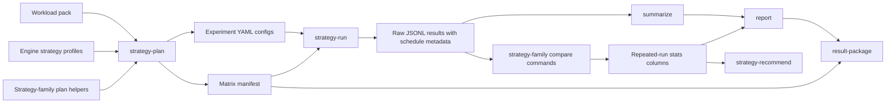

# Strategy Plan And Run Architecture

Status: Proposed
Date: 2026-07-01
Owner: KVOptBench maintainers

## 1. Problem Statement And Goals

KVOptBench already has focused plan, run, compare, summary, report, advisor, and result-package surfaces. It also has helper APIs for deterministic run schedules and repeated-run statistics. The next product shape should make strategy planning and execution coherent across strategy families without turning KVOptBench into a serving engine, GPU provisioner, or backend process manager.

The proposed `strategy-plan` and `strategy-run` commands should:

- produce reproducible benchmark matrices from workload packs, strategy families, concurrency cells, and existing engine strategy profiles
- write normal KVOptBench experiment configs that can still be inspected and run independently
- write a matrix manifest that records exactly what was planned, which configs were generated, and which reproducibility defaults apply
- execute planned configs with deterministic ordering, optional randomization, repetitions, warmups, and run-order metadata
- make repeated-run statistics visible in comparison CSVs, Markdown reports, strategy advisor inputs, and result packages
- keep missing metrics explicit instead of inferring unavailable backend, cache, memory, or GPU telemetry
- label results as exploratory or publishable-candidate based on evidence, not on a single CLI flag

Non-goals:

- launching, supervising, scaling, or stopping model-serving backends
- provisioning GPUs, cloud instances, Kubernetes resources, or storage systems
- replacing the existing focused plan commands
- hiding or backfilling failed requests
- fabricating engine-reported metrics when an endpoint or telemetry adapter did not expose them
- declaring a result publishable when required controls, repetitions, or provenance are absent

## 2. Inputs And References

This proposal is based on the current public repo shape:

- `AGENTS.md`: config-driven experiments, no engine lifecycle management, no fake metrics, every result needs reproducibility metadata
- `docs/architecture/README.md`: KVOptBench records, imports, normalizes, packages, and recommends from evidence
- `kvoptbench/cli.py`: existing focused plan, run, compare, summarize, report, result-package, and strategy-recommend commands
- `kvoptbench/experiments/*`: current focused plan helpers that write YAML experiment configs
- `kvoptbench/runner/schedule.py`: deterministic repeated-run schedule helper
- `kvoptbench/analysis/statistics.py`: repeated-run aggregation and comparison helpers
- `guides/benchmark_validity.md`: public validity rules for randomized order, repeated trials, confidence intervals, effect size, and missing metrics
- `guides/reproducibility.md`: reproducibility checklist and result-package expectations

## 3. Current State

Current CLI shape is intentionally modular:

- `cache-plan`, `cache-run`, `cache-compare`
- `prefill-decode-plan`, `prefill-decode-run`, `prefill-decode-compare`
- `long-context-plan`, `long-context-run`, `long-context-compare`
- `kv-quant-plan`, `kv-quant-run`, `kv-quant-compare`
- `kv-offload-plan`, `kv-offload-run`, `kv-offload-compare`
- `spec-decoding-plan`, `spec-decoding-run`, `spec-decoding-compare`
- `disagg-plan`, `disagg-run`, `disagg-compare`
- `summarize`, `report`, `strategy-recommend`, and `result-package`

Those commands are useful because each strategy family has its own controls and comparison logic. For example, cache experiments require shared-prefix and random-prefix workloads plus cold and warm passes, while KV quantization compares baseline and quantized strategies on a matched workload.

The gap is that the repo does not yet expose a coherent public CLI contract for:

- planning a multi-strategy benchmark matrix in one place
- recording a matrix manifest with config hashes and workload-pack provenance
- running a whole matrix with deterministic randomized order and repetitions
- carrying run-order metadata into raw result rows and downstream artifacts
- using repeated-run statistics consistently in comparison CSVs, reports, and advisor confidence

## 4. Requirements And Constraints

Functional requirements:

- `strategy-plan` must generate normal experiment YAML configs plus a matrix manifest.
- `strategy-plan` must accept workload packs rather than requiring every strategy family to receive ad hoc workload arguments.
- `strategy-plan` must validate strategy names against current engine strategy profiles or strategy-family rules.
- `strategy-plan` must support multiple strategy families in one matrix.
- `strategy-plan` must support concurrency cells, output directories, max-output-token defaults, endpoint type, model identity, and run label metadata.
- `strategy-run` must execute only the configs in a matrix manifest or explicit plan directory.
- `strategy-run` must support deterministic order, randomized order by seed, repetitions, warmups, and concurrency cells.
- `strategy-run` must record schedule and run-order metadata for every scheduled config execution.
- Comparison CSVs and reports must expose run count, mean, p50, p95, confidence intervals, effect size, and missing-metric status when repeated trials are available.
- Missing metrics must stay null or absent in stats fields; they must not become zero.

Constraints:

- Existing focused commands remain valid and should be used by `strategy-plan` internally where they already encode correct controls.
- Existing `ExperimentConfig` remains the unit of execution.
- Backend launch commands, server flags, and endpoint lifecycle remain outside `strategy-run`.
- Unit and integration tests for the planner and schedule logic must not require a GPU, model weights, external APIs, or live services.
- Public examples must avoid private endpoint details and secrets.

## 5. Assumptions

- The first implementation can write `plan_manifest.json` and `run_manifest.json` as JSON, while experiment configs remain YAML.
- Existing focused plan helpers can be reused before introducing a generic planner abstraction for every strategy family.
- `strategy-run` can inject schedule metadata by writing temporary scheduled config copies or by adding an execution overlay before calling the existing runner.
- Warmup rows are useful for diagnostics but should be excluded from publishable comparison rows by default.
- A result can be labeled by the runner, but publishable status is still validated later from evidence in manifests, raw rows, comparison CSVs, reports, and packages.

## 6. Alternatives Considered

### Keep Only Focused Commands

This preserves simplicity, but it leaves run ordering, repetitions, and matrix provenance as manual operator discipline. It also makes it too easy for reports and packages to miss randomization seeds, run counts, or repeated-run statistics.

### Build A Backend-Orchestrating Strategy Runner

This would make KVOptBench responsible for serving engine lifecycle, cloud resources, and process state. That conflicts with the project boundary. KVOptBench should benchmark configured endpoints; it should not become the thing that operates them.

### Recommended: Manifest-Oriented Strategy Planner And Runner

The recommended approach is a thin orchestration layer over current configs:

- focused plan helpers still encode strategy-family-specific controls
- `strategy-plan` writes a matrix manifest and generated configs
- `strategy-run` executes that manifest through a deterministic schedule
- comparison, report, advisor, and package commands consume the added metadata

This keeps implementation risk low while making benchmark evidence stronger.

## 7. Recommended Architecture



The architecture has four layers:

- Planning layer: expands user intent into explicit configs and a matrix manifest.
- Execution layer: runs those configs in a deterministic schedule and writes run-order metadata.
- Evidence layer: summarizes and compares raw results, including repeated-run statistics when available.
- Packaging layer: carries matrix and run manifests into the reviewable result package.

## 8. `strategy-plan` Command Contract

`strategy-plan` is a proposed future command. It should not claim to run experiments. It writes a plan.

Proposed CLI:

```bash
kvoptbench strategy-plan \
  --plan-dir configs/strategy_plan \
  --matrix-id qasper_prefix_cache_v1 \
  --provider local \
  --engine vllm \
  --endpoint-type vllm \
  --model-id example/model \
  --base-url http://127.0.0.1:8000/v1 \
  --workload-pack workloads/packs/qasper_32k.yaml \
  --strategy-family cache \
  --strategy-family kv-quant \
  --strategy cache_on \
  --strategy cache_off \
  --strategy baseline \
  --strategy kv_fp8 \
  --concurrency 1 \
  --concurrency 4 \
  --repeat-count 5 \
  --randomization-seed 20260701 \
  --run-label exploratory \
  --output-dir results/raw
```

Required inputs:

| Field | Purpose |
| --- | --- |
| `--plan-dir` | Directory for generated configs and `plan_manifest.json`. |
| `--matrix-id` | Stable identifier for the planned matrix. |
| `--provider` | Endpoint provider label used in configs and result rows. |
| `--engine` | Engine profile used for strategy validation. |
| `--model-id` | Model identifier used in configs and result rows. |
| `--base-url` | Reachable OpenAI-compatible endpoint URL for generated configs. |
| `--workload-pack` | Public-safe workload pack file that maps workload roles to workload JSONL files and dataset manifests. |
| `--strategy-family` | One or more strategy families to expand. |
| `--output-dir` | Raw result output directory referenced by generated configs. |

Optional inputs:

| Field | Purpose |
| --- | --- |
| `--endpoint-type` | Endpoint type for config validation, such as `mock`, `openai_compatible`, `vllm`, or `sglang`. |
| `--strategy` | Explicit strategy names; if omitted, use family defaults. |
| `--concurrency` | One or more concurrency cells. |
| `--repeat-count` | Planned repetition count for downstream run scheduling. |
| `--randomization-seed` | Planned seed for deterministic randomized execution. |
| `--warmups` | Planned warmup cycles per cell. |
| `--max-output-tokens` | Default max output tokens for generated configs. |
| `--run-label` | `exploratory` or `publishable_candidate`; this is evidence metadata, not a guarantee. |
| `--official-run` | Existing boolean field may still be populated for backward compatibility. |

### Workload Pack Contract

A workload pack groups workload files and dataset manifests by role. The pack should be public-safe and path-relative to the current project or invocation directory.

```yaml
schema_version: "1"
name: qasper_32k
description: QASPER shared-prefix and random-prefix workloads for cache-aware strategy tests.
workloads:
  shared_prefix:
    path: workloads/generated/qasper_shared_prefix_32k.jsonl
    manifest: workloads/generated/qasper_shared_prefix_32k_manifest.json
    role: treatment
    required_for:
      - cache
      - prefix_sweep
  random_prefix:
    path: workloads/generated/qasper_random_prefix_32k.jsonl
    manifest: workloads/generated/qasper_random_prefix_32k_manifest.json
    role: control
    required_for:
      - cache
      - prefix_sweep
  long_context:
    path: workloads/generated/qasper_long_context_32k.jsonl
    manifest: workloads/generated/qasper_long_context_32k_manifest.json
    role: treatment
    required_for:
      - kv-quant
      - kv-offload
```

`strategy-plan` should fail fast when a selected strategy family requires a workload role that the pack does not provide. For example, cache experiments require random-prefix controls for publishable claims.

### Matrix Manifest Contract

`strategy-plan` writes `plan_manifest.json` beside the generated configs.

```json
{
  "schema_version": "1",
  "matrix_id": "qasper_prefix_cache_v1",
  "generated_at": "2026-07-01T00:00:00Z",
  "run_label": "exploratory",
  "provider": "local",
  "engine": "vllm",
  "endpoint_type": "vllm",
  "model_id": "example/model",
  "workload_pack": {
    "name": "qasper_32k",
    "path": "workloads/packs/qasper_32k.yaml",
    "sha256": "<hash>"
  },
  "strategy_families": ["cache", "kv-quant"],
  "strategies": ["cache_off", "cache_on", "baseline", "kv_fp8"],
  "concurrency_cells": [1, 4],
  "schedule_defaults": {
    "repeat_count": 5,
    "warmups": 1,
    "randomize": true,
    "seed": 20260701
  },
  "configs": [
    {
      "config_path": "configs/strategy_plan/qasper_prefix_cache_v1_vllm_cache_on_shared_prefix_warm_c1.yaml",
      "sha256": "<hash>",
      "strategy_family": "cache",
      "strategy": "cache_on",
      "workload_role": "shared_prefix",
      "concurrency": 1,
      "include_in_comparison": true
    }
  ],
  "notes": [
    "This manifest describes planned endpoint experiments. It does not launch or manage serving processes."
  ]
}
```

The manifest must store:

- schema version
- matrix id
- generation timestamp
- command-level run label
- provider, engine, endpoint type, and model id
- workload-pack path and hash
- dataset manifest paths and hashes when available
- strategy families and strategies
- concurrency cells
- generated config paths and hashes
- schedule defaults
- validation warnings
- public-safe notes about unsupported or missing evidence

### Output Config Contract

Generated YAML configs should remain normal `ExperimentConfig` files. `strategy-plan` should add metadata under `metadata` rather than requiring a new runner schema.

Recommended metadata additions:

```yaml
metadata:
  strategy_matrix_id: qasper_prefix_cache_v1
  strategy_family: cache
  workload_pack_name: qasper_32k
  workload_role: shared_prefix
  comparison_role: treatment
  run_label: exploratory
  planned_repeat_count: 5
  planned_randomization_seed: 20260701
  planned_warmups: 1
  planned_concurrency_cell: 1
```

Existing focused metadata, such as `cache_pass`, `workload_profile`, `control_workload`, `kv_quantization_role`, or `speculative_decoding_role`, should be preserved.

## 9. Existing Plan Commands As Lower-Level Builders

`strategy-plan` should not reimplement every strategy-family matrix from scratch on day one. It should delegate when a focused helper already knows the right controls:

| Strategy family | Existing builder to reuse | Required roles |
| --- | --- | --- |
| Cache | `cache-plan` helper | shared-prefix workload, random-prefix control, cold and warm passes |
| Prefix sweep | workload pack plus existing prefix comparison | shared-prefix ratio workloads and random-prefix controls |
| Prefill/decode | `prefill-decode-plan` helper | prefill/decode workload buckets |
| Long context | `long-context-plan` helper | long-context pressure workloads |
| KV quantization | `kv-quant-plan` helper | baseline and quantized strategy configs |
| KV offload | `kv-offload-plan` helper | baseline and offload strategy configs |
| Speculative decoding | `spec-decoding-plan` helper | baseline and speculative strategy configs |
| Prefill/decode disaggregation | `disagg-plan` helper | baseline and disaggregated strategy configs |

The higher-level planner owns cross-family concerns:

- common matrix id
- common workload-pack provenance
- config hashing
- concurrency expansion
- run-label consistency
- schedule defaults
- manifest-level validation warnings

The lower-level builders own strategy-family-specific controls and metadata.

## 10. `strategy-run` Command Contract

`strategy-run` is a proposed future command. It executes already planned configs. It does not start engines or alter backend configuration.

Proposed CLI:

```bash
kvoptbench strategy-run \
  --matrix-manifest configs/strategy_plan/plan_manifest.json \
  --output-run-manifest results/runs/qasper_prefix_cache_v1_run_manifest.json \
  --repeat-count 5 \
  --warmups 1 \
  --randomize \
  --seed 20260701 \
  --run-label exploratory
```

Required inputs:

| Field | Purpose |
| --- | --- |
| `--matrix-manifest` | Manifest produced by `strategy-plan`. |
| `--output-run-manifest` | Run-order manifest written by `strategy-run`. |

Optional inputs:

| Field | Purpose |
| --- | --- |
| `--repeat-count` | Overrides or confirms the manifest default. Must be at least 1 for measured runs. |
| `--warmups` | Warmup cycles before measured repetitions. |
| `--randomize` | Randomize condition order deterministically by seed. |
| `--seed` | Seed used to build the run schedule. |
| `--include-config` | Restrict execution to specific config paths from the matrix. |
| `--exclude-config` | Exclude specific config paths from the matrix. |
| `--run-label` | Execution label copied into schedule metadata. |
| `--dry-run` | Write the run manifest without executing configs. |

### Schedule Behavior

`strategy-run` should use deterministic schedule semantics:

- without randomization, preserve manifest config order, repeated by repeat index
- with randomization, expand all measured runs and shuffle by seed
- warmups run before measured runs by default
- warmups are marked with `warmup: true`
- measured rows are marked with `warmup: false`
- each scheduled execution receives a stable `schedule_id`
- every execution receives `trial_index`, `repeat_index`, and `order_index`

The existing schedule helper already models the core fields: config path, trial index, repeat index, order index, schedule id, seed, randomization flag, and repeat count. The CLI product should carry those fields into raw result metadata and the run manifest.

### Run Manifest Contract

`strategy-run` writes a run manifest with planned and observed execution metadata.

```json
{
  "schema_version": "1",
  "matrix_id": "qasper_prefix_cache_v1",
  "schedule_id": "schedule-abcdef1234567890",
  "run_label": "exploratory",
  "randomize": true,
  "seed": 20260701,
  "repeat_count": 5,
  "warmups": 1,
  "started_at": "2026-07-01T00:00:00Z",
  "finished_at": "2026-07-01T00:30:00Z",
  "executions": [
    {
      "order_index": 0,
      "trial_index": 2,
      "repeat_index": 0,
      "warmup": false,
      "config_path": "configs/strategy_plan/example.yaml",
      "config_sha256": "<hash>",
      "output_path": "results/raw/example.jsonl",
      "status": "completed"
    }
  ]
}
```

### Raw Result Metadata

Every request row produced by `strategy-run` should include schedule metadata in the existing `metadata.config_metadata` object, or another stable metadata field if the result schema later adds one.

Required fields:

| Field | Meaning |
| --- | --- |
| `strategy_matrix_id` | Matrix id from `plan_manifest.json`. |
| `schedule_id` | Deterministic schedule id. |
| `run_group_id` | Group id used to aggregate repeated runs. Usually equal to schedule id or matrix id plus selected filters. |
| `order_index` | Position in actual execution order. |
| `trial_index` | Position of the config in the unexpanded matrix. |
| `repeat_index` | Repetition number for measured runs. |
| `repeat_count` | Total measured repetitions requested. |
| `randomization_seed` | Seed used for the schedule. |
| `randomized_order` | Boolean. |
| `warmup` | Boolean. |
| `run_label` | `exploratory` or `publishable_candidate`. |
| `config_sha256` | Hash of the executed config. |

This metadata is what lets downstream CSVs and reports distinguish a single smoke result from a repeated, randomized matrix.

## 11. Statistics Wiring Into CSVs And Reports

The repeated-run helpers should become a visible part of the product, not just internal APIs.

### Summary CSV

`summarize` should continue to produce request-level grouped summaries. It may remain lightweight, but when schedule metadata is present it should preserve:

- `strategy_matrix_id`
- `schedule_id`
- `run_group_id`
- `run_label`
- `warmup`
- `repeat_count`
- `repeat_index` or enough support columns for downstream repeated-run comparison

Warmup rows should be excluded from default measured summaries unless a future explicit option includes them.

### Comparison CSVs

Strategy-family compare commands should use repeated-run aggregation when repeated schedule metadata exists. The expected columns should include both existing family-specific interpretation fields and repeated-stat fields.

Required repeated-stat columns:

| Column pattern | Meaning |
| --- | --- |
| `run_count` | Minimum valid measured run count across the compared conditions for that row. |
| `<metric>_baseline_count` | Numeric sample count for the baseline condition. |
| `<metric>_candidate_count` | Numeric sample count for the candidate condition. |
| `<metric>_baseline_mean` | Baseline mean. |
| `<metric>_candidate_mean` | Candidate mean. |
| `<metric>_baseline_p50` | Baseline p50. |
| `<metric>_candidate_p50` | Candidate p50. |
| `<metric>_baseline_p95` | Baseline p95. |
| `<metric>_candidate_p95` | Candidate p95. |
| `<metric>_baseline_ci95_low` | Lower 95 percent confidence interval for baseline mean, or null. |
| `<metric>_baseline_ci95_high` | Upper 95 percent confidence interval for baseline mean, or null. |
| `<metric>_candidate_ci95_low` | Lower 95 percent confidence interval for candidate mean, or null. |
| `<metric>_candidate_ci95_high` | Upper 95 percent confidence interval for candidate mean, or null. |
| `<metric>_percent_delta` | Candidate percent change relative to baseline. |
| `<metric>_effect_size` | Standardized effect size when both sides have enough numeric samples. |
| `stats_status` | `ok`, `insufficient_repetitions`, `missing_metric`, or `not_applicable`. |

Core metrics:

- `ttft_ms`
- `tpot_ms`
- `itl_ms`
- `e2e_latency_ms`
- `requests_per_second`
- `input_tokens_per_second`
- `output_tokens_per_second`
- `quality_score`
- strategy-specific metrics such as cache miss penalty, cache hit rate, GPU memory peak, or speculative acceptance rate when available

Effect size should be null when either side lacks enough valid numeric observations. For latency metrics, negative percent deltas usually mean the candidate is faster. Reports should explain direction rather than relying on readers to infer it.

### Reports

Markdown reports should surface repeated-run evidence near each strategy-family section:

- run label
- run count
- p50 and p95
- mean and confidence interval
- percent delta
- effect size
- missing metrics that affect the recommendation
- whether warmups were excluded
- whether condition order was randomized
- randomization seed

Reports must not hide nulls. If confidence intervals are unavailable because there is only one valid run, the report should say that the run is exploratory or statistically underpowered.

### Strategy Advisor

The advisor should consume repeated-stat fields when present:

- upgrade confidence only when repeated trials, randomization, controls, quality guardrails, and required telemetry are present
- downgrade confidence for missing required telemetry
- mark a recommendation inconclusive when the core metric for that strategy family is unavailable
- include run count, confidence interval availability, and effect size in confidence rationale

### Result Package

`result-package` should include:

- `plan_manifest.json`
- `run_manifest.json`
- generated config snapshots
- raw JSONL results
- workload files and samples
- dataset manifests
- summary CSVs
- comparison CSVs
- reports
- strategy-advisor JSON and Markdown
- `missing_metrics.json`

The package should preserve package-relative paths and hashes. It should not rely on absolute local paths to explain reproducibility.

## 12. Missing Metrics Behavior

Missing metrics are first-class evidence. They should be represented consistently:

- Raw JSONL rows keep `missing_metrics` and metric provenance.
- Summary CSVs union missing metrics by group.
- Comparison CSVs report missing metrics that affect each strategy decision.
- Reports explain which metrics were unavailable and whether the recommendation remains usable.
- Advisor confidence is reduced when required telemetry is missing.
- Result packages include `missing_metrics.json`.

Rules:

- Do not treat missing GPU memory as zero memory.
- Do not treat missing cache hit rate as no cache hits.
- Do not treat missing provider token counts as tokenizer-native counts.
- Do not compute confidence intervals on imputed values.
- Do not drop failed requests to improve a strategy result.

## 13. Exploratory And Publishable-Candidate Labeling

Use explicit labels, but treat labels as claims that must be validated by evidence.

Recommended labels:

| Label | Meaning |
| --- | --- |
| `exploratory` | Useful for debugging, smoke testing, local mock runs, incomplete telemetry, small samples, or incomplete controls. |
| `publishable_candidate` | Has the required evidence shape for external review, pending final human review and result-package inspection. |
| `published` | Reserved for reviewed artifacts that have been packaged and intentionally released. |

`strategy-run --run-label publishable_candidate` should not automatically make the result publishable. Reports and packages should still check:

- public dataset manifests and workload hashes exist
- required controls exist
- condition order was randomized or the report explains why not
- repeated trials exist
- run count is visible
- p50 and p95 are present for core metrics
- confidence intervals or an explicit insufficiency note are present
- effect size or practical delta is present
- failed requests and timeouts are preserved
- quality guardrails are present for strategies where quality can regress
- missing metrics are explicit

## 14. Deployment And Environment Strategy

No new deployment topology is proposed. `strategy-plan` and `strategy-run` are local CLI commands that operate on files and configured endpoints.

Environment behavior:

- `strategy-plan` writes configs and manifests.
- `strategy-run` reads configs and calls the existing experiment runner.
- The serving endpoint must already be reachable.
- Endpoint secrets should continue to flow through environment variables or redacted config fields.
- Tests use temporary files, fake runners, and mock endpoints.

Rollback is simple: remove the generated plan directory or rerun the focused commands directly. Existing focused commands remain valid during and after the higher-level CLI addition.

## 15. Security And Compliance

Security requirements:

- Do not print or package API keys, tokens, or credential-bearing URLs.
- Preserve redaction in config snapshots.
- Use public-safe workload paths and dataset metadata in examples.
- Store endpoint metadata needed for reproducibility without exposing secrets.
- Keep raw result rows honest about failed requests and missing metrics.

The planner should avoid embedding private absolute paths in manifests. If users pass such paths locally, packaging should still preserve package-relative paths and redact sensitive config fields.

## 16. Reliability, Scalability, And Performance

Expected scale is file-based benchmark orchestration, not service operation:

- matrices should support dozens to hundreds of configs
- schedules should be deterministic and cheap to rebuild
- execution remains bounded by configured endpoint capacity and config concurrency
- failed config executions should be recorded in the run manifest
- partial runs should be resumable in a future extension by skipping completed config hashes and repeat indexes

Reliability rules:

- `strategy-run` should validate all planned config paths before execution.
- A missing config hash mismatch should fail before running.
- A single failed endpoint health check should produce structured failed rows, consistent with the current runner behavior.
- The run manifest should record completed, failed, skipped, and warmup executions.

## 17. Observability And Operations

The proposed commands should write observable local artifacts:

- `plan_manifest.json`: planned matrix and config hashes
- generated YAML configs: exact runner inputs
- `run_manifest.json`: actual schedule and execution status
- raw JSONL files: request-level evidence
- summary CSV: grouped request metrics
- comparison CSVs: strategy-family decisions and repeated stats
- Markdown reports: human-readable evidence
- result package: review unit

There is no on-call or daemon ownership model because these are CLI commands. Operational ownership is the user or benchmark runner invoking the CLI.

## 18. Testing And Validation Plan

All tests should run without a GPU, model download, external API, or live service unless explicitly marked as optional manual validation.

Required tests:

- `strategy-plan` writes only the requested plan directory artifacts and generated experiment configs.
- `strategy-plan` validates workload-pack roles and fails when a required role is missing.
- `strategy-plan` validates strategies against the selected engine profile or strategy-family rules.
- `strategy-plan` writes stable config hashes into `plan_manifest.json`.
- `strategy-plan` preserves family-specific metadata from focused helpers.
- `strategy-plan` expands concurrency cells without hardcoding strategies in runner logic.
- `strategy-run --dry-run` writes a deterministic run manifest without executing configs.
- `strategy-run` produces identical randomized schedules for the same seed and different schedules for different seeds.
- `strategy-run` records `schedule_id`, `run_group_id`, `order_index`, `trial_index`, `repeat_index`, `repeat_count`, `randomization_seed`, `randomized_order`, `warmup`, and `run_label`.
- `strategy-run` can execute through a fake runner in tests and records output paths in schedule order.
- Warmup executions are excluded from measured comparison rows by default.
- Repeated-run comparison includes run count, mean, p50, p95, confidence interval bounds, percent delta, effect size, and stats status.
- Missing metrics produce null stats and explicit missing-metric output, not zeros.
- Reports render run label, randomized order, seed, run count, confidence interval status, effect size, and missing-metric caveats.
- Advisor confidence uses repeated-run and missing-metric evidence when present.
- Result packages include plan and run manifests with package-relative paths and hashes.
- Public documentation and generated examples pass forbidden-term and secret-pattern scans.

Manual validation for real endpoints:

- generate dataset-backed workloads and manifests
- run `strategy-plan`
- inspect generated configs and `plan_manifest.json`
- run `strategy-run` against an already running endpoint
- run `summarize`, family compare commands, `report`, `strategy-recommend`, and `result-package`
- verify the package includes manifests, raw results, summaries, comparison CSVs, reports, missing metrics, and reproduction commands

## 19. Acceptance Criteria

The feature is implementation-ready when:

- `strategy-plan` and `strategy-run` contracts are documented and implemented without changing KVOptBench into a backend manager.
- Existing focused plan, run, and compare commands still work.
- A workload pack can generate a cache plan with shared-prefix and random-prefix controls.
- A multi-family matrix can generate configs and a manifest with hashes.
- A deterministic schedule can be reproduced from the same matrix, repeat count, seed, and randomization flag.
- Raw result rows include schedule metadata for every measured execution.
- Comparison CSVs include repeated-run statistics when repeated metadata is present.
- Reports and advisor outputs surface run count, p50, p95, mean, confidence interval status, effect size, and missing metrics.
- Exploratory and publishable-candidate labels are visible and evidence-backed.
- Missing telemetry remains explicit and never becomes a fabricated metric.
- Result packages include matrix and run manifests.
- Tests cover planner validation, schedule determinism, fake-run execution, repeated statistics, missing metrics, report rendering, and packaging.

## 20. Next Actions

Recommended implementation order:

1. Add workload-pack parsing and validation.
2. Add `strategy-plan` manifest writing around one focused family, starting with cache because it has clear required controls.
3. Add concurrency-cell expansion and config hashing.
4. Add `strategy-run --dry-run` schedule manifest generation.
5. Add fake-run execution tests that inject schedule metadata.
6. Wire repeated-run stats into one comparison CSV, then generalize the pattern.
7. Render repeated-run stats and labels in reports.
8. Include plan and run manifests in result packages.
9. Update advisor confidence to use run count, confidence interval availability, effect size, and missing-metric evidence.
