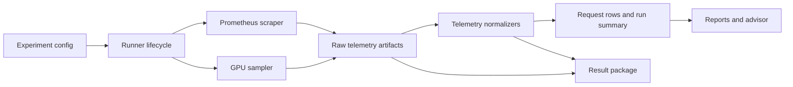

# Telemetry Lifecycle Architecture

Status: Draft
Date: 2026-07-01
Owner: KVOptBench maintainers

## 1. Problem Statement and Goals

KVOptBench needs a telemetry architecture that can capture backend and GPU evidence
around a benchmark run without becoming a serving engine or infrastructure
orchestrator. The benchmark should record what an already-running OpenAI-compatible
endpoint exposes, preserve unavailable metrics as unavailable, and package telemetry
artifacts so a result can be audited later.

Goals:

- Capture Prometheus-compatible engine snapshots before, during, and after a run.
- Capture GPU telemetry samples during the active benchmark window when a GPU source
  is available.
- Link telemetry to `run_id`, `experiment_id`, and `task_id` when the source exposes
  enough labels or timestamps to support that linkage.
- Preserve missing telemetry as `null`, `missing_metrics`, and unavailable metric
  provenance rather than fabricating backend internals.
- Feed reports, strategy-advisor confidence, and result packages with auditable
  telemetry evidence.
- Keep unit tests independent of GPUs, live Prometheus servers, external APIs, model
  downloads, and provider infrastructure.

Non-goals:

- No backend process management. KVOptBench does not start, stop, restart, deploy, or
  health-manage vLLM, SGLang, LMCache, Mooncake, llm-d, or provider endpoints.
- No GPU requirement for unit tests. GPU sampling must be testable with fixtures and
  fake sources.
- No fabricated metrics. Missing cache, queue, GPU, or engine metrics remain missing.
- No provider-specific orchestration. RunPod, Lambda Cloud, local GPU, and generic
  OpenAI-compatible endpoints use the same benchmark-side telemetry contract.

## 2. Inputs and References

This design aligns with the existing public contracts in:

- `AGENTS.md`
- `README.md`
- `guides/benchmark_validity.md`
- `guides/metric_provenance.md`
- `guides/reproducibility.md`
- `guides/real_endpoint_vllm_sglang.md`
- `kvoptbench/schemas.py`
- `kvoptbench/runner/experiment.py`
- `kvoptbench/runner/provenance.py`
- `kvoptbench/telemetry/prometheus.py`
- `kvoptbench/telemetry/nvidia_smi.py`
- `kvoptbench/telemetry/metrics.py`
- `kvoptbench/packaging/result_package.py`
- `tests/test_telemetry_adapters.py`
- `tests/test_result_package.py`
- `tests/test_runner_schema.py`

Current foundation:

- Request rows already include `run_id`, `experiment_id`, `task_id`,
  `missing_metrics`, `metric_provenance`, and an optional environment snapshot.
- Metric provenance already distinguishes `client_observed`, `provider_reported`,
  `engine_reported`, `gpu_reported`, `imported`, `derived`, and `estimated` values.
- Offline Prometheus parsing supports Prometheus text exposition and JSON API-like
  artifacts without fetching from a live server.
- Offline GPU normalization supports supplied `nvidia-smi`, DCGM, text, CSV, dict,
  and list samples without requiring a live GPU.
- Result packages already emit `run_manifest.json`, `missing_metrics.json`,
  `metric_provenance.json`, `README_result.md`, copied artifacts, hashes, samples,
  dataset provenance, and redacted config snapshots.

This document describes the implementation target for live lifecycle collection and
packaging. It does not claim that live Prometheus polling or live GPU sampling is
already wired into the experiment runner.

## 3. Requirements and Constraints

Functional requirements:

- Telemetry collection is optional and config-driven.
- Telemetry failures do not fail an otherwise valid benchmark run unless the user
  explicitly requests a hard telemetry gate.
- Every captured telemetry artifact has a source, timestamp window, normalized metric
  names, and missing-metric reasons when expected metrics are unavailable.
- Request-level result rows continue to preserve unavailable telemetry as null fields
  plus `missing_metrics`.
- Reports and strategy recommendations treat telemetry-dependent claims as lower
  confidence when key telemetry is missing.
- Result packages include telemetry artifacts only after redaction and package-relative
  path normalization.

Constraints:

- KVOptBench sits above OpenAI-compatible endpoints and should not require engine
  internals to run.
- Unit tests must use local fixtures, fake clocks, fake collectors, and mock endpoint
  data.
- Absolute local paths, private endpoint URLs, credentials, and private workload data
  must not be embedded in publishable package metadata.
- Engine-specific metric names should normalize through adapter mappings rather than
  leaking engine details into generic runner logic.

## 4. Recommended Architecture

Implement telemetry as a run-scoped lifecycle service with two optional collectors:

- A Prometheus scraper that records before, during, and after snapshots from one or
  more configured metrics endpoints.
- A GPU sampler that records time-series samples from a configured GPU source during
  the active request window.

The runner owns lifecycle timing and run identifiers. Collectors own source access and
raw capture. Normalizers own conversion into KVOptBench metric names. The result writer
and package builder own persistence, redaction, and artifact inventory.



Lifecycle sequence:

1. Load benchmark config and optional telemetry config.
2. Create `run_id` and validate the endpoint health check.
3. Capture pre-run Prometheus snapshots when configured.
4. Start GPU sampler when configured and available.
5. Execute scheduled benchmark requests.
6. Stop GPU sampler after the final request settles.
7. Capture post-run Prometheus snapshots when configured.
8. Normalize telemetry into metric records, run-level snapshots, and missing reasons.
9. Attach telemetry-derived fields to request rows only when attribution is defensible.
10. Emit report, advisor, and package artifacts with provenance and caveats.

## 5. Telemetry Config Shape

The telemetry block should remain design-level and provider-neutral. Names below are
the target contract, not a statement that all fields exist today.

```yaml
telemetry:
  enabled: true
  hard_fail_on_collection_error: false
  storage_dir: results/telemetry
  attach_raw_samples_to_package: true

  prometheus:
    enabled: true
    endpoints:
      - name: engine
        url_env: KVOPTBENCH_PROMETHEUS_URL
        scrape_interval_seconds: 5
        scrape_timeout_seconds: 2
        phases: [before, during, after]
        expected_metrics:
          - engine_reported_cache_hit_rate
          - queue_time_ms

  gpu:
    enabled: true
    source: nvidia_smi
    sample_interval_seconds: 1
    expected_metrics:
      - gpu_memory_used_gb
      - gpu_memory_peak_gb
```

Config rules:

- `url_env` points to an environment variable name, not a stored endpoint URL.
- `hard_fail_on_collection_error` defaults to `false`; telemetry gaps usually lower
  confidence instead of aborting benchmark evidence.
- `storage_dir` is local generated output and should be ignored by version control.
- `expected_metrics` drives missing-metric reporting. If an expected metric is not
  present, the normalized snapshot records an explicit missing reason.
- Engine-specific metric aliases belong in adapter mappings. Generic runner code uses
  normalized metric names.

## 6. Prometheus Scrape Lifecycle

Prometheus collection has three phases.

| Phase | Timing | Purpose | Output |
|---|---|---|---|
| `before` | After endpoint health check and before first request | Baseline counters, exporter metadata, cache or queue state before benchmark load | Raw payload, normalized records, scrape metadata |
| `during` | Periodic interval while benchmark requests are active | Time-series evidence for queue depth, running requests, cache counters, engine latency, or provider-exported internals | Timestamped raw payloads and normalized samples |
| `after` | After final request and sampler shutdown | Final counters and state for delta calculations | Raw payload, normalized records, scrape metadata |

Scrape record target contract:

```json
{
  "schema_version": "1",
  "collector": "prometheus",
  "source_name": "engine",
  "run_id": "1730000000-cache-smoke",
  "experiment_id": "cache-smoke",
  "phase": "during",
  "scrape_started_at": "2026-07-01T12:00:05Z",
  "scrape_finished_at": "2026-07-01T12:00:05.250Z",
  "success": true,
  "raw_artifact_path": "telemetry/run/prometheus/engine-during-0001.prom",
  "records": [
    {
      "name": "engine_reported_cache_hit_rate",
      "raw_name": "vllm:prefix_cache_hit_rate",
      "value": 0.82,
      "source_type": "engine_reported",
      "labels": {"model_name": "example/model"}
    }
  ],
  "missing_metrics": []
}
```

Prometheus attribution rules:

- Run-level attribution is valid when the scrape happened inside the benchmark
  lifecycle and the source endpoint matches the configured benchmark endpoint.
- Experiment-level attribution is valid when `experiment_id` is known from the runner.
- Request-level attribution is valid only when labels or timestamps can isolate a
  request or a narrow request window.
- `task_id` attribution is valid only when the backend exports task-like labels,
  request identifiers propagated by KVOptBench, or an unambiguous timestamp window.
- If only aggregate counters are available, store aggregate telemetry at run level and
  do not copy it into each request as if it were request-specific.

Counter handling:

- Before and after snapshots can support counter deltas for run-level metrics.
- During snapshots can support peak, mean, p50, p95, or last-value summaries depending
  on metric type.
- Counter resets should be detected when a later value is lower than an earlier value.
  Reset-affected deltas should be marked unavailable unless the reset window can be
  isolated safely.

## 7. GPU Sampler Lifecycle

GPU sampling begins after endpoint health check and before benchmark requests start.
It ends after all scheduled requests finish and response processing has settled.

GPU sample target contract:

```json
{
  "schema_version": "1",
  "collector": "gpu",
  "source_type": "nvidia_smi_csv",
  "run_id": "1730000000-cache-smoke",
  "experiment_id": "cache-smoke",
  "sample_started_at": "2026-07-01T12:00:00Z",
  "sample_finished_at": "2026-07-01T12:00:30Z",
  "sample_interval_seconds": 1,
  "metrics": {
    "gpu_memory_used_gb": 12.0,
    "gpu_memory_peak_gb": 14.5
  },
  "samples": [
    {
      "timestamp": "2026-07-01T12:00:05Z",
      "gpu_index": "0",
      "gpu_memory_used_gb": 12.0
    }
  ],
  "missing_metrics": []
}
```

GPU sampler rules:

- `gpu_memory_used_gb` should represent the latest normalized value when a single row
  needs a current sample.
- `gpu_memory_peak_gb` should represent the maximum observed value during the run
  window.
- Multi-GPU samples should include a GPU index or stable device label when available.
  Run-level summaries may include per-device metrics and total peak metrics.
- If no GPU source is configured, present, or parseable, leave GPU fields null and list
  the expected GPU fields in `missing_metrics`.
- GPU telemetry is run-window evidence. Attach it to request rows only when timestamp
  windows make the association defensible; otherwise keep it run-level and package it
  as supporting evidence.

## 8. Snapshot Linkage

Telemetry linkage should use the strongest defensible key available.

| Link level | Required evidence | Examples |
|---|---|---|
| Run | `run_id`, benchmark start/end timestamps, and configured endpoint or source name | GPU peak memory for the whole run |
| Experiment | `experiment_id` from config and run-level telemetry window | Cache counter delta for one experiment config |
| Task | `task_id` plus exported request label, propagated metadata, or tight timestamp window | Per-request engine queue time if exported by request id |
| Source only | Source name and timestamp, but no reliable run window | Imported telemetry artifact retained for audit but not used for row metrics |

When linkage is uncertain, store the telemetry artifact and record the limitation rather
than over-attributing a value.

## 9. Missing Telemetry and Confidence Impact

Missing telemetry behavior is part of the public result contract:

- Store unavailable metric fields as null.
- Add the metric name to `missing_metrics`.
- Add `metric_provenance` with `available: false` and a concrete `missing_reason`.
- Carry missing-metric summaries into report caveats and result-package
  `missing_metrics.json`.
- Lower advisor confidence when the missing metric materially affects the strategy
  recommendation.

Examples:

| Missing metric | Impact |
|---|---|
| `cache_hit_rate` | Prefix-cache recommendations should rely on controls and client timing only, or be marked lower confidence. |
| `gpu_memory_peak_gb` | KV offload and KV quantization recommendations should be lower confidence or inconclusive when memory change is central to the claim. |
| `queue_time_ms` | Throughput and latency conclusions can still use client-observed data, but engine scheduling claims should be avoided. |
| `speculative_acceptance_rate` | Speculative decoding recommendations should not claim acceptance behavior without engine telemetry. |

Missing telemetry does not mean the value is zero. It means the value was not captured
or not exposed by the configured source.

## 10. Storage Artifacts

Telemetry artifacts should be generated output and should remain outside committed
source by default.

Recommended local layout:

```text
results/telemetry/
  <run_id>/
    telemetry_manifest.json
    prometheus/
      <source>-before.prom
      <source>-during-0001.prom
      <source>-after.prom
      normalized.jsonl
    gpu/
      samples.csv
      normalized.json
```

`telemetry_manifest.json` target contract:

```json
{
  "schema_version": "1",
  "run_id": "1730000000-cache-smoke",
  "experiment_id": "cache-smoke",
  "created_at": "2026-07-01T12:00:31Z",
  "sources": [
    {
      "name": "engine",
      "collector": "prometheus",
      "phases": ["before", "during", "after"],
      "artifact_paths": [
        "prometheus/engine-before.prom",
        "prometheus/engine-after.prom"
      ],
      "missing_metrics": []
    },
    {
      "name": "gpu",
      "collector": "gpu",
      "artifact_paths": ["gpu/samples.csv", "gpu/normalized.json"],
      "missing_metrics": ["gpu_memory_peak_gb"]
    }
  ]
}
```

Artifact rules:

- Manifest paths are relative to the telemetry directory or package root.
- Raw payloads may be included in packages only after redaction checks.
- Normalized telemetry should include source type, source name, normalized metric name,
  raw metric name, units when known, timestamps, labels, and missing reasons.
- Package builders should hash telemetry artifacts the same way they hash raw results,
  reports, configs, and workload files.

## 11. Report and Package Integration

Reports should use telemetry in three ways:

- Metric tables can include telemetry-derived fields only when provenance marks them
  available.
- Caveats should list unavailable telemetry that affects interpretation.
- Strategy-advisor confidence should include telemetry quality as a reason, not only
  latency or throughput deltas.

Result packages should include:

- `telemetry_manifest.json`, when telemetry artifacts were supplied.
- Raw telemetry artifacts that pass redaction policy.
- Normalized telemetry artifacts for review without source-specific parsing.
- `missing_metrics.json` entries for telemetry fields that were expected but missing.
- `metric_provenance.json` entries for engine-reported and GPU-reported metrics.
- `run_manifest.json` artifact inventory with package-relative telemetry paths and
  hashes.

Public package rule:

- A result package may be publishable with missing telemetry, but the package must
  state the missing fields and confidence impact. When missing telemetry materially
  affects the claim, label the result exploratory or the recommendation inconclusive.

## 12. Reliability and Failure Handling

Telemetry collection should degrade explicitly:

- If Prometheus scraping times out, record the timeout as a missing reason for the
  affected source and phase.
- If one telemetry source fails, other sources continue.
- If telemetry artifacts cannot be parsed, keep raw artifacts for audit when safe and
  record normalized metrics as unavailable.
- If result writing succeeds but telemetry packaging fails, the package command should
  fail clearly rather than silently omitting user-supplied telemetry artifacts.
- If telemetry collection is configured as a hard gate, fail before publication steps
  and preserve the failure reason.

Timeouts and intervals should be bounded so telemetry collection cannot hang a run
indefinitely.

## 13. Testing and Validation Plan

Unit tests:

- Parse Prometheus text and JSON fixtures into normalized metric records.
- Normalize `nvidia-smi` CSV/text, DCGM text, dict, and list samples into
  `TelemetrySnapshot`.
- Preserve missing GPU fields as explicit `MissingMetric` entries.
- Validate telemetry config defaults and optional blocks.
- Exercise lifecycle state transitions with fake Prometheus and GPU collectors.
- Verify timestamp-window attribution does not promote run-level aggregate data to
  request-level fields without evidence.

Integration tests:

- Run the mock endpoint with telemetry disabled and confirm existing behavior remains
  unchanged.
- Run with fake telemetry collectors and confirm request rows, summaries, reports, and
  packages preserve available and missing telemetry.
- Build a result package with telemetry artifacts and confirm package-relative paths,
  hashes, `missing_metrics.json`, and `metric_provenance.json`.

Regression checks:

- No unit test requires a GPU, live Prometheus, external API, provider account, or model
  weights.
- Missing telemetry remains null and listed in `missing_metrics`.
- Redacted package config and telemetry manifests do not include private URLs,
  credential values, or absolute local paths.
- Existing parser tests and result-package tests continue to pass.

Recommended command set after implementation:

```bash
pytest tests/test_telemetry_adapters.py tests/test_result_package.py tests/test_runner_schema.py -q
pytest -q
```

## 14. Acceptance Criteria

- Telemetry config is optional, documented, and ignored safely when absent.
- Prometheus lifecycle supports before, during, and after phases with bounded timeouts.
- GPU sampling supports run-window collection and offline fixture normalization.
- Telemetry artifacts have a manifest with source names, timestamp windows, relative
  artifact paths, hashes through the package manifest, and missing reasons.
- Request rows only include telemetry-derived metrics when the attribution level is
  defensible.
- Missing telemetry is represented as null fields, `missing_metrics`, unavailable
  metric provenance, report caveats, and package metadata.
- Strategy-advisor confidence decreases when a missing telemetry field is required for
  the recommendation.
- Tests cover parser, sampler, lifecycle, package, and report behavior without live
  GPUs or external services.
- Documentation states explicitly that KVOptBench does not manage backend processes
  and does not fabricate unavailable metrics.

## 15. Risks and Open Questions

Risks:

- Engine metric names and labels vary across versions, so adapter mappings will need
  version-aware tests.
- Aggregate Prometheus counters may be tempting to copy into request rows. The
  implementation must enforce attribution rules.
- Raw telemetry labels can contain endpoint or deployment details. Packaging must apply
  redaction checks before including raw artifacts.

Open questions:

- Should the first live collector support direct scrape URLs, Prometheus API query
  ranges, or both?
- Should request identifiers be propagated to supported backends through headers or
  metadata when safe?
- Should telemetry hard gates be a package-time validation option, a run-time option,
  or both?

## 16. Next Actions

1. Add config schema support for optional telemetry blocks.
2. Implement collector interfaces with fake collector tests first.
3. Wire Prometheus before/during/after collection behind the optional config.
4. Wire GPU run-window sampling behind the optional config.
5. Add telemetry artifact inventory support to result packages.
6. Extend reports and advisor confidence with telemetry-specific caveats.
